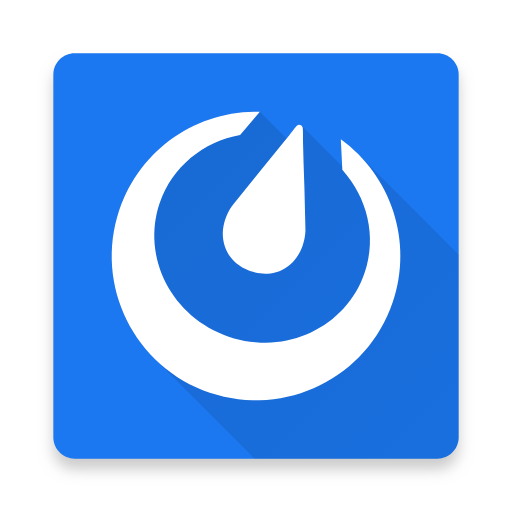
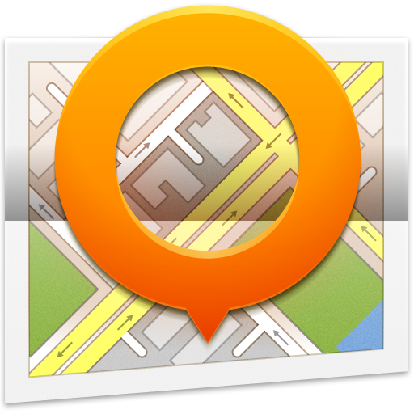
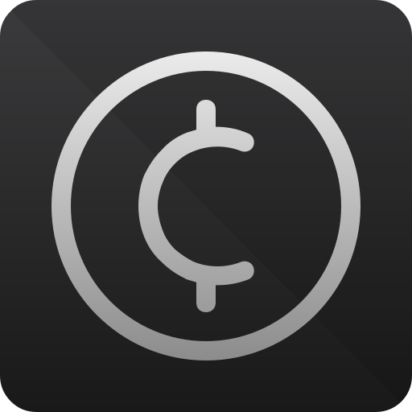
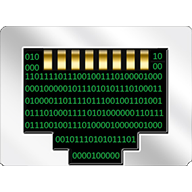

_🇬🇧 For English, see [README.md](README.md)_

_🇳🇱 Voor Nederlands, zie [README-nl.md](README-nl.md)_

# F-Droid

TODO

<table>
<tr><th colspan="2"> Básica</th><th> Replaces</th></tr>
<tr id="org.fdroid.fdroid"><td></td>
<td valign="top"><a target="_blank" href="https://f-droid.org/en/packages/org.fdroid.fdroid"><strong>F-Droid</strong></a> 
 <small></small></td>
<td valign="top">Google Play, Amazon Appstore, (Samsung) Galaxy Store, Huawei AppGallery</td></tr>
<tr id="org.fossify.clock"><td></td>
<td valign="top"><a target="_blank" href="https://f-droid.org/en/packages/org.fossify.clock"><strong>Fossify Clock</strong></a> 
 <small></small></td>
<td valign="top"></td></tr>
<tr id="org.fossify.phone"><td></td>
<td valign="top"><a target="_blank" href="https://f-droid.org/en/packages/org.fossify.phone"><strong>Fossify Phone</strong></a> 
 <small></small></td>
<td valign="top"></td></tr>
<tr id="com.menny.android.anysoftkeyboard"><td></td>
<td valign="top"><a target="_blank" href="https://f-droid.org/en/packages/com.menny.android.anysoftkeyboard"><strong>AnySoftKeyboard</strong></a> 
 <small></small></td>
<td valign="top">GBoard (Google Keyboard), Microsoft SwiftKey, Yandex Keyboard</td></tr>
<tr id="de.nulide.findmydevice"><td></td>
<td valign="top"><a target="_blank" href="https://f-droid.org/en/packages/de.nulide.findmydevice"><strong>FindMyDevice</strong></a> 
 <small></small></td>
<td valign="top">Google Find My Device, Samsung Find</td></tr>
<tr id="ru.seva.finder"><td></td>
<td valign="top"><a target="_blank" href="https://f-droid.org/en/packages/ru.seva.finder"><strong>Finder</strong></a> 
 <small></small></td>
<td valign="top">Google Find My Device, Samsung Find</td></tr>
<tr id="io.keepalive.android"><td></td>
<td valign="top"><a target="_blank" href="https://f-droid.org/en/packages/io.keepalive.android"><strong>Keep Alive</strong></a> 
 <small></small></td>
<td valign="top"></td></tr>
<tr><th colspan="2"> </th><th> Replaces</th></tr>
<tr id="com.github.catfriend1.syncthingandroid"><td></td>
<td valign="top"><a target="_blank" href="https://f-droid.org/en/packages/com.github.catfriend1.syncthingandroid"><strong>Syncthing-Fork</strong></a> 
 <small><a target="_blank" href="https://github.com/PanderMusubi/foss/blob/main/README.md#syncthing">DT</a> <a target="_blank" href="https://alternativeto.net/software/syncthing/about/">AT</a></small></td>
<td valign="top">Dropbox, Google Drive, Microsoft OneDrive, Yandex Disk, Yandex Cloud</td></tr>
<tr id="org.fossify.filemanager"><td></td>
<td valign="top"><a target="_blank" href="https://f-droid.org/en/packages/org.fossify.filemanager"><strong>Fossify File Manager</strong></a> 
 <small></small></td>
<td valign="top"></td></tr>
<tr id="com.google.android.diskusage"><td></td>
<td valign="top"><a target="_blank" href="https://f-droid.org/en/packages/com.google.android.diskusage"><strong>DiskUsage</strong></a> 
 <small></small></td>
<td valign="top">Storage Analyzer & Disk Usage, CCleaner, AVG Cleaner</td></tr>
<tr><th colspan="2"> </th><th> Replaces</th></tr>
<tr id="org.ironfoxoss.ironfox"><td></td>
<td valign="top"><a target="_blank" href="https://f-droid.org/en/packages/org.ironfoxoss.ironfox"><strong>IronFox</strong></a> 
 <small><a target="_blank" href="https://github.com/PanderMusubi/foss/blob/main/README.md#firefox">DT</a> <a target="_blank" href="https://alternativeto.net/software/ironfox/about/">AT</a></small></td>
<td valign="top">(Mozilla) Firefox, Fennec, Google Chrome, Microsoft Edge, Opera, Samsung Internet Browser, Yandex Browser, Instapaper, Pocket</td></tr>
<tr id="org.liberty.android.freeotpplus"><td></td>
<td valign="top"><a target="_blank" href="https://f-droid.org/en/packages/org.liberty.android.freeotpplus"><strong>FreeOTP+</strong></a> 
 <small></small></td>
<td valign="top">Google Authenticator, Microsoft Authenticator, Authy</td></tr>
<tr id="com.kunzisoft.keepass.libre"><td></td>
<td valign="top"><a target="_blank" href="https://f-droid.org/en/packages/com.kunzisoft.keepass.libre"><strong>KeePassDX</strong></a> 
 <small><a target="_blank" href="https://github.com/PanderMusubi/foss/blob/main/README.md#keepassxc">DT</a></small></td>
<td valign="top">Google Password Manager, Microsoft Authenticator, LastPass, 1Password, Bitwarden Password Manager, Yandex Key</td></tr>
<tr id="com.nononsenseapps.feeder"><td></td>
<td valign="top"><a target="_blank" href="https://f-droid.org/en/packages/com.nononsenseapps.feeder"><strong>Feeder</strong></a> 
 <small></small></td>
<td valign="top">Google News, Samsung upday news, Opera News, Flipboard, Feedly, Inoreader, Instapaper, Pocket</td></tr>
<tr id="com.capyreader.app"><td></td>
<td valign="top"><a target="_blank" href="https://f-droid.org/en/packages/com.capyreader.app"><strong>Capy Reader</strong></a> 
 <small></small></td>
<td valign="top">Google News, Samsung upday news, Opera News, Flipboard, Feedly, Inoreader, Instapaper, Pocket</td></tr>
<tr><th colspan="2"> </th><th> Replaces</th></tr>
<tr id="net.thunderbird.android"><td></td>
<td valign="top"><a target="_blank" href="https://f-droid.org/en/packages/net.thunderbird.android"><strong>Thunderbird</strong></a> 
 <small><a target="_blank" href="https://github.com/PanderMusubi/foss/blob/main/README.md#thunderbird">DT</a> <a target="_blank" href="https://alternativeto.net/software/mozilla-thunderbird/about/">AT</a></small></td>
<td valign="top">Microsoft Outlook, (Google) Gmail, Yahoo Mail, Samsung Email, Yandex Mail</td></tr>
<tr id="org.sufficientlysecure.keychain"><td></td>
<td valign="top"><a target="_blank" href="https://f-droid.org/en/packages/org.sufficientlysecure.keychain"><strong>OpenKeychain</strong></a> 
 <small></small></td>
<td valign="top"></td></tr>
<tr><th colspan="2"> </th><th> Replaces</th></tr>
<tr id="org.fossify.contacts"><td></td>
<td valign="top"><a target="_blank" href="https://f-droid.org/en/packages/org.fossify.contacts"><strong>Fossify Contacts</strong></a> 
 <small><a target="_blank" href="https://github.com/PanderMusubi/foss/blob/main/README.md#thunderbird">DT</a></small></td>
<td valign="top"></td></tr>
<tr id="org.fossify.calendar"><td></td>
<td valign="top"><a target="_blank" href="https://f-droid.org/en/packages/org.fossify.calendar"><strong>Fossify Calendar</strong></a> 
 <small><a target="_blank" href="https://github.com/PanderMusubi/foss/blob/main/README.md#thunderbird">DT</a></small></td>
<td valign="top">Google Calendar, Samsung Calendar, Microsoft Outlook, Yandex Calendar</td></tr>
<tr id="at.bitfire.icsdroid"><td></td>
<td valign="top"><a target="_blank" href="https://f-droid.org/en/packages/at.bitfire.icsdroid"><strong>ICSx⁵</strong></a> 
 <small><a target="_blank" href="https://github.com/PanderMusubi/foss/blob/main/README.md#thunderbird">DT</a></small></td>
<td valign="top"></td></tr>
<tr id="at.bitfire.davdroid"><td></td>
<td valign="top"><a target="_blank" href="https://f-droid.org/en/packages/at.bitfire.davdroid"><strong>DAVx⁵</strong></a> 
 <small><a target="_blank" href="https://github.com/PanderMusubi/foss/blob/main/README.md#thunderbird">DT</a></small></td>
<td valign="top"></td></tr>
<tr id="saschpe.contactevents"><td></td>
<td valign="top"><a target="_blank" href="https://f-droid.org/en/packages/saschpe.contactevents"><strong> Birthday Calendar</strong></a> 
 <small><a target="_blank" href="https://github.com/PanderMusubi/foss/blob/main/README.md#thunderbird">DT</a></small></td>
<td valign="top"></td></tr>
<tr id="org.fossify.notes"><td></td>
<td valign="top"><a target="_blank" href="https://f-droid.org/en/packages/org.fossify.notes"><strong>Fossify Notes</strong></a> 
 <small><a target="_blank" href="https://github.com/PanderMusubi/foss/blob/main/README.md#thunderbird">DT</a></small></td>
<td valign="top">Google Keep, Microsoft OneNote, Evernote, Samsung Notes</td></tr>
<tr id="org.tasks"><td></td>
<td valign="top"><a target="_blank" href="https://f-droid.org/en/packages/org.tasks"><strong>Tasks.org</strong></a> 
 <small><a target="_blank" href="https://github.com/PanderMusubi/foss/blob/main/README.md#thunderbird">DT</a></small></td>
<td valign="top"></td></tr>
<tr id="com.ichi2.anki"><td></td>
<td valign="top"><a target="_blank" href="https://f-droid.org/en/packages/com.ichi2.anki"><strong>AnkiDroid</strong></a> 
 <small><a target="_blank" href="https://github.com/PanderMusubi/foss/blob/main/README.md#yes">DT</a></small></td>
<td valign="top">Quizlet, Flashcards World, LingQ</td></tr>
<tr><th colspan="2"> </th><th> Replaces</th></tr>
<tr id="org.fossify.messages"><td></td>
<td valign="top"><a target="_blank" href="https://f-droid.org/en/packages/org.fossify.messages"><strong>Fossify SMS Messenger</strong></a> 
 <small></small></td>
<td valign="top">Google Messages</td></tr>
<tr id="signal"><td></td>
<td valign="top"><a target="_blank" href="https://f-droid.org/en/packages/signal"><strong>Signal</strong></a> 
 <small><a target="_blank" href="https://github.com/PanderMusubi/foss/blob/main/README.md#signal">DT</a> <a target="_blank" href="https://alternativeto.net/software/signal-private-messenger/about/">AT</a></small></td>
<td valign="top">WhatsApp, Facebook Messenger, Zoom, Discord, Google Meet, Google Hangouts, Instagram, Snapchat, LINE, Skype</td></tr>
<tr id="org.forkgram.messenger"><td></td>
<td valign="top"><a target="_blank" href="https://f-droid.org/en/packages/org.forkgram.messenger"><strong>Forkgram (Telegram)</strong></a> 
 <small><a target="_blank" href="https://github.com/PanderMusubi/foss/blob/main/README.md#telegram">DT</a> <a target="_blank" href="https://alternativeto.net/software/telegram/about/">AT</a></small></td>
<td valign="top">WhatsApp, Skype, Facebook Messenger, Discord, Google Hangouts, Instagram, Snapchat, LINE, Viber</td></tr>
<tr id="org.briarproject.briar.android"><td></td>
<td valign="top"><a target="_blank" href="https://f-droid.org/en/packages/org.briarproject.briar.android"><strong>Briar</strong></a> 
 <small><a target="_blank" href="https://github.com/PanderMusubi/foss/blob/main/README.md#briar">DT</a> <a target="_blank" href="https://alternativeto.net/software/briar/about/">AT</a></small></td>
<td valign="top">WhatsApp, Facebook Messenger, Zoom, Discord, Google Meet, Google Hangouts, Instagram, Snapchat, LINE, Skype</td></tr>
<tr id="com.mattermost.rnbeta"><td></td>
<td valign="top"><a target="_blank" href="https://f-droid.org/en/packages/com.mattermost.rnbeta"><strong>Mattermost</strong></a> 
 <small><a target="_blank" href="https://github.com/PanderMusubi/foss/blob/main/README.md#mattermost">DT</a> <a target="_blank" href="https://alternativeto.net/software/mattermost/about/">AT</a></small></td>
<td valign="top"></td></tr>
<tr id="im.vector.app"><td></td>
<td valign="top"><a target="_blank" href="https://f-droid.org/en/packages/im.vector.app"><strong>Element</strong></a> 
 <small><a target="_blank" href="https://github.com/PanderMusubi/foss/blob/main/README.md#element">DT</a> <a target="_blank" href="https://alternativeto.net/software/element-app/about/">AT</a></small></td>
<td valign="top">Viber</td></tr>
<tr id="io.element.android.x"><td></td>
<td valign="top"><a target="_blank" href="https://f-droid.org/en/packages/io.element.android.x"><strong>Element X</strong></a> 
 <small><a target="_blank" href="https://github.com/PanderMusubi/foss/blob/main/README.md#element">DT</a> <a target="_blank" href="https://alternativeto.net/software/element-x/about/">AT</a></small></td>
<td valign="top">Viber</td></tr>
<tr id="eu.siacs.conversations"><td></td>
<td valign="top"><a target="_blank" href="https://f-droid.org/en/packages/eu.siacs.conversations"><strong>Conversations</strong></a> 
 <small></small></td>
<td valign="top"></td></tr>
<tr id="io.heckel.ntfy"><td></td>
<td valign="top"><a target="_blank" href="https://f-droid.org/en/packages/io.heckel.ntfy"><strong>nfty</strong></a> 
 <small><a target="_blank" href="https://alternativeto.net/software/ntfy/about/">AT</a></small></td>
<td valign="top"></td></tr>
<tr id="org.linphone"><td></td>
<td valign="top"><a target="_blank" href="https://f-droid.org/en/packages/org.linphone"><strong>Linphone</strong></a> 
 <small><a target="_blank" href="https://alternativeto.net/software/linphone/about/">AT</a></small></td>
<td valign="top"></td></tr>
<tr id="org.avmedia.remotevideocam"><td></td>
<td valign="top"><a target="_blank" href="https://f-droid.org/en/packages/org.avmedia.remotevideocam"><strong>Remote Video Camera</strong></a> 
 <small></small></td>
<td valign="top"></td></tr>
<tr id="org.jitsi.meet"><td></td>
<td valign="top"><a target="_blank" href="https://f-droid.org/en/packages/org.jitsi.meet"><strong>Jitsi Meet</strong></a> 
 <small><a target="_blank" href="https://github.com/PanderMusubi/foss/blob/main/README.md#jitsi-meet">DT</a> <a target="_blank" href="https://alternativeto.net/software/jitsi-meet/about/">AT</a></small></td>
<td valign="top">Zoom, Microsoft Teams, Google Meet, Discord, Skype</td></tr>
<tr><th colspan="2"> </th><th> Replaces</th></tr>
<tr id="org.fossify.gallery"><td></td>
<td valign="top"><a target="_blank" href="https://f-droid.org/en/packages/org.fossify.gallery"><strong>Fossify Gallery</strong></a> 
 <small></small></td>
<td valign="top">(Google) Pixel Camera</td></tr>
<tr id="org.fossify.camera"><td></td>
<td valign="top"><a target="_blank" href="https://f-droid.org/en/packages/org.fossify.camera"><strong>Fossify Camera</strong></a> 
 <small></small></td>
<td valign="top"></td></tr>
<tr id="org.schabi.newpipe"><td></td>
<td valign="top"><a target="_blank" href="https://f-droid.org/en/packages/org.schabi.newpipe"><strong>NewPipe</strong></a> 
 <small><a target="_blank" href="https://alternativeto.net/software/newpipe/about/">AT</a></small></td>
<td valign="top">YouTube, SoundCloud, Mixcloud, Bandcamp</td></tr>
<tr id="com.github.niqdev.ipcam"><td></td>
<td valign="top"><a target="_blank" href="https://f-droid.org/en/packages/com.github.niqdev.ipcam"><strong>IPCam Demo</strong></a> 
 <small></small></td>
<td valign="top"></td></tr>
<tr id="is.xyz.mpv"><td></td>
<td valign="top"><a target="_blank" href="https://f-droid.org/en/packages/is.xyz.mpv"><strong>MPV</strong></a> 
 <small><a target="_blank" href="https://github.com/PanderMusubi/foss/blob/main/README.md#mpv">DT</a></small></td>
<td valign="top"></td></tr>
<tr id="org.xbmc.kodi"><td></td>
<td valign="top"><a target="_blank" href="https://f-droid.org/en/packages/org.xbmc.kodi"><strong>Kodi</strong></a> 
 <small><a target="_blank" href="https://github.com/PanderMusubi/foss/blob/main/README.md#kodi">DT</a></small></td>
<td valign="top"></td></tr>
<tr id="org.xbmc.kore"><td></td>
<td valign="top"><a target="_blank" href="https://f-droid.org/en/packages/org.xbmc.kore"><strong>Kore</strong></a> 
 <small></small></td>
<td valign="top"></td></tr>
<tr><th colspan="2"> </th><th> Replaces</th></tr>
<tr id="org.fossify.voicerecorder"><td></td>
<td valign="top"><a target="_blank" href="https://f-droid.org/en/packages/org.fossify.voicerecorder"><strong>Fossify Voice Recorder</strong></a> 
 <small></small></td>
<td valign="top">(Samsung) Voice Recorder, Samsung Notes</td></tr>
<tr id="org.fossify.musicplayer"><td></td>
<td valign="top"><a target="_blank" href="https://f-droid.org/en/packages/org.fossify.musicplayer"><strong>Fossify Music Player</strong></a> 
 <small></small></td>
<td valign="top">Samsung Music, Apple Music, Mi Music</td></tr>
<tr id="ch.blinkenlights.android.vanilla"><td></td>
<td valign="top"><a target="_blank" href="https://f-droid.org/en/packages/ch.blinkenlights.android.vanilla"><strong>Vanilla Music</strong></a> 
 <small></small></td>
<td valign="top">Samsung Music, Apple Music, Mi Music</td></tr>
<tr id="org.y20k.transistor"><td></td>
<td valign="top"><a target="_blank" href="https://f-droid.org/en/packages/org.y20k.transistor"><strong>Transistor</strong></a> 
 <small></small></td>
<td valign="top">Samsung Music, Apple Music, Mi Music</td></tr>
<tr id="org.musicpd"><td></td>
<td valign="top"><a target="_blank" href="https://f-droid.org/en/packages/org.musicpd"><strong>MPD</strong></a> 
 <small></small></td>
<td valign="top"></td></tr>
<tr id="org.gateshipone.malp"><td></td>
<td valign="top"><a target="_blank" href="https://f-droid.org/en/packages/org.gateshipone.malp"><strong>M.A.L.P.</strong></a> 
 <small></small></td>
<td valign="top"></td></tr>
<tr id="de.danoeh.antennapod"><td></td>
<td valign="top"><a target="_blank" href="https://f-droid.org/en/packages/de.danoeh.antennapod"><strong>AntennaPod</strong></a> 
 <small></small></td>
<td valign="top">Apple Podcast, Yandex Podcasts</td></tr>
<tr id="org.y20k.escapepod"><td></td>
<td valign="top"><a target="_blank" href="https://f-droid.org/en/packages/org.y20k.escapepod"><strong>Escapepod</strong></a> 
 <small></small></td>
<td valign="top">Apple Podcast, Yandex Podcasts</td></tr>
<tr><th colspan="2"> </th><th> Replaces</th></tr>
<tr id="app.comaps.fdroid"><td></td>
<td valign="top"><a target="_blank" href="https://f-droid.org/en/packages/app.comaps.fdroid"><strong>CoMaps</strong></a> 
 <small></small></td>
<td valign="top">Google Maps, Waze, TomTom, Yandex Maps, Yandex Navigator</td></tr>
<tr id="net.osmand.plus"><td></td>
<td valign="top"><a target="_blank" href="https://f-droid.org/en/packages/net.osmand.plus"><strong>OsmAnd</strong></a> 
 <small></small></td>
<td valign="top">Google Maps, Waze, TomTom, Yandex Maps, Yandex Navigator</td></tr>
<tr id="de.grobox.liberario"><td></td>
<td valign="top"><a target="_blank" href="https://f-droid.org/en/packages/de.grobox.liberario"><strong>Transportr</strong></a> 
 <small></small></td>
<td valign="top">Google Maps, Yandex Trains, 9292 (Netherlands), NS (Netherlands)</td></tr>
<tr id="net.vonforst.evmap"><td></td>
<td valign="top"><a target="_blank" href="https://f-droid.org/en/packages/net.vonforst.evmap"><strong>EVMap</strong></a> 
 <small></small></td>
<td valign="top"></td></tr>
<tr id="net.gitsaibot.af"><td></td>
<td valign="top"><a target="_blank" href="https://f-droid.org/en/packages/net.gitsaibot.af"><strong>AF Weather Widget</strong></a> 
 <small></small></td>
<td valign="top">Google Weather, Yahoo Weather, Yandex Weather, Buienradar (Netherlands), KNMI (Netherlands)</td></tr>
<tr id="org.ligi.passandroid"><td></td>
<td valign="top"><a target="_blank" href="https://f-droid.org/en/packages/org.ligi.passandroid"><strong>PassAndroid</strong></a> 
 <small></small></td>
<td valign="top">Google Wallet, WalletPasses</td></tr>
<tr><th colspan="2"> </th><th> Replaces</th></tr>
<tr id="com.keylesspalace.tusky"><td></td>
<td valign="top"><a target="_blank" href="https://f-droid.org/en/packages/com.keylesspalace.tusky"><strong>Tusky</strong></a> 
Mastodon <small></small></td>
<td valign="top"></td></tr>
<tr id="org.nuclearfog.twidda"><td></td>
<td valign="top"><a target="_blank" href="https://f-droid.org/en/packages/org.nuclearfog.twidda"><strong>Shitter</strong></a> 
Mastodon <small></small></td>
<td valign="top"></td></tr>
<tr id="com.twidere.twiderex"><td></td>
<td valign="top"><a target="_blank" href="https://f-droid.org/en/packages/com.twidere.twiderex"><strong>Twidere X</strong></a> 
 <small></small></td>
<td valign="top"></td></tr>
<tr id="it.rignanese.leo.slimfacebook"><td></td>
<td valign="top"><a target="_blank" href="https://f-droid.org/en/packages/it.rignanese.leo.slimfacebook"><strong>SlimSocial for Facebook</strong></a> 
 <small></small></td>
<td valign="top"></td></tr>
<tr><th colspan="2"> </th><th> Replaces</th></tr>
<tr id="org.btcmap"><td></td>
<td valign="top"><a target="_blank" href="https://f-droid.org/en/packages/org.btcmap"><strong>BTC Map</strong></a> 
 <small></small></td>
<td valign="top"></td></tr>
<tr id="com.cointrend"><td></td>
<td valign="top"><a target="_blank" href="https://f-droid.org/en/packages/com.cointrend"><strong>CoinTrend</strong></a> 
 <small></small></td>
<td valign="top"></td></tr>
<tr id="hashengineering.darkcoin.wallet"><td></td>
<td valign="top"><a target="_blank" href="https://f-droid.org/en/packages/hashengineering.darkcoin.wallet"><strong>Dash Wallet</strong></a> 
 <small><a target="_blank" href="https://github.com/PanderMusubi/foss/blob/main/README.md#dash">DT</a></small></td>
<td valign="top"></td></tr>
<tr><th colspan="2"> dispositivos periféricos</th><th> Replaces</th></tr>
<tr id="eu.darken.capod"><td></td>
<td valign="top"><a target="_blank" href="https://f-droid.org/en/packages/eu.darken.capod"><strong>CAPod</strong></a> 
 <small></small></td>
<td valign="top"></td></tr>
<tr id="nodomain.freeyourgadget.gadgetbridge"><td></td>
<td valign="top"><a target="_blank" href="https://f-droid.org/en/packages/nodomain.freeyourgadget.gadgetbridge"><strong>Gadgetbridge</strong></a> 
 <small></small></td>
<td valign="top"></td></tr>
<tr id="org.openhab.habdroid"><td></td>
<td valign="top"><a target="_blank" href="https://f-droid.org/en/packages/org.openhab.habdroid"><strong>openHAB</strong></a> 
 <small></small></td>
<td valign="top">SmartThings, Goolge Home, Smart Life, Nest</td></tr>
<tr id="io.homeassistant.companion.android.minimal"><td></td>
<td valign="top"><a target="_blank" href="https://f-droid.org/en/packages/io.homeassistant.companion.android.minimal"><strong>Home Assistant</strong></a> 
 <small></small></td>
<td valign="top">SmartThings, Goolge Home, Smart Life, Nest</td></tr>
<tr><th colspan="2"> </th><th> Replaces</th></tr>
<tr id="ch.protonvpn.android"><td></td>
<td valign="top"><a target="_blank" href="https://f-droid.org/en/packages/ch.protonvpn.android"><strong>ProtonVPN</strong></a> 
 <small></small></td>
<td valign="top"></td></tr>
<tr id="org.calyxinstitute.vpn"><td></td>
<td valign="top"><a target="_blank" href="https://f-droid.org/en/packages/org.calyxinstitute.vpn"><strong>Calyx VPN</strong></a> 
 <small></small></td>
<td valign="top"></td></tr>
<tr id="com.aaronjwood.portauthority"><td></td>
<td valign="top"><a target="_blank" href="https://f-droid.org/en/packages/com.aaronjwood.portauthority"><strong>Port Authority</strong></a> 
 <small></small></td>
<td valign="top"></td></tr>
<tr id="com.vrem.wifianalyzer"><td></td>
<td valign="top"><a target="_blank" href="https://f-droid.org/en/packages/com.vrem.wifianalyzer"><strong>WiFiAnalyzer</strong></a> 
 <small></small></td>
<td valign="top"></td></tr>
<tr id="org.connectbot"><td></td>
<td valign="top"><a target="_blank" href="https://f-droid.org/en/packages/org.connectbot"><strong>ConnectBot</strong></a> 
 <small></small></td>
<td valign="top">Termius, JuiceSSH</td></tr>
<tr id="com.manimarank.websitemonitor"><td></td>
<td valign="top"><a target="_blank" href="https://f-droid.org/en/packages/com.manimarank.websitemonitor"><strong>Website Monitor</strong></a> 
 <small></small></td>
<td valign="top"></td></tr>
<tr><th colspan="2"> </th><th> Replaces</th></tr>
<tr id="com.health.openscale"><td></td>
<td valign="top"><a target="_blank" href="https://f-droid.org/en/packages/com.health.openscale"><strong>openScale</strong></a> 
 <small></small></td>
<td valign="top">Google Fit, Samsung Health, (Google) Fitbit</td></tr>
<tr id="org.runnerup.free"><td></td>
<td valign="top"><a target="_blank" href="https://f-droid.org/en/packages/org.runnerup.free"><strong>RunnerUp</strong></a> 
 <small></small></td>
<td valign="top">Strava, adidas Running, Running App, Nike Run Club, ACICS Runkeeper</td></tr>
<tr id="com.jithware.brethap"><td></td>
<td valign="top"><a target="_blank" href="https://f-droid.org/en/packages/com.jithware.brethap"><strong>Brethap</strong></a> 
 <small></small></td>
<td valign="top"></td></tr>
<tr id="de.arnowelzel.android.periodical"><td></td>
<td valign="top"><a target="_blank" href="https://f-droid.org/en/packages/de.arnowelzel.android.periodical"><strong>Periodical</strong></a> 
 <small></small></td>
<td valign="top">Period Tracker, Flo Period, Clue Period</td></tr>
<tr><th colspan="2"> </th><th> Replaces</th></tr>
<tr id="com.anysoftkeyboard.languagepack.dutch_oss"><td></td>
<td valign="top"><a target="_blank" href="https://f-droid.org/en/packages/com.anysoftkeyboard.languagepack.dutch_oss"><strong>AnySoftKeyboard Dutch</strong></a> 
 <small></small></td>
<td valign="top">GBoard (Google Keyboard), Microsoft SwiftKey, Yandex Keyboard</td></tr>
<tr id="foss.cnugteren.nlweer"><td></td>
<td valign="top"><a target="_blank" href="https://f-droid.org/en/packages/foss.cnugteren.nlweer"><strong>NLWeer</strong></a> 
 <small></small></td>
<td valign="top">Google Weather, Yahoo Weather, Yandex Weather, Buienradar, KNMI</td></tr>
</table>

TODO

