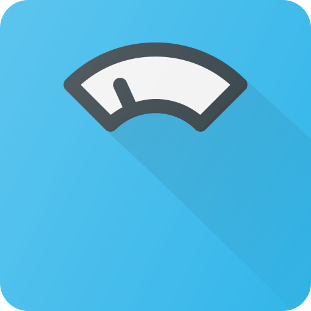

_🇬🇧 For English, see [README.md](README.md)_

_🇳🇱 Voor Nederlands, zie [README-nl.md](README-nl.md)_

# F-Droid

TODO

<table>
<tr><th colspan="2"> Básica</th><th> Replaces</th></tr>
<tr><td></td>
<td valign="top"><a target="_blank" href="https://f-droid.org/en/packages/org.fdroid.fdroid"><strong>F-Droid</strong></a> 
</td>
<td valign="top"><strong>Google Play, Amazon Appstore</strong></td></tr>
<tr><td></td>
<td valign="top"><a target="_blank" href="https://f-droid.org/en/packages/org.fossify.phone"><strong>Fossify Phone</strong></a> 
</td>
<td valign="top"><strong></strong></td></tr>
<tr><td></td>
<td valign="top"><a target="_blank" href="https://f-droid.org/en/packages/org.fossify.contacts"><strong>Fossify Contacts</strong></a> 
</td>
<td valign="top"><strong></strong></td></tr>
<tr><td></td>
<td valign="top"><a target="_blank" href="https://f-droid.org/en/packages/com.menny.android.anysoftkeyboard"><strong>AnySoftKeyboard</strong></a> 
</td>
<td valign="top"><strong>GBoard (Google Keyboard), Microsoft SwiftKey</strong></td></tr>
<tr><td></td>
<td valign="top"><a target="_blank" href="https://f-droid.org/en/packages/de.nulide.findmydevice"><strong>FindMyDevice</strong></a> 
</td>
<td valign="top"><strong>Google Find My Device, Samsung Find</strong></td></tr>
<tr><td></td>
<td valign="top"><a target="_blank" href="https://f-droid.org/en/packages/ru.seva.finder"><strong>Finder</strong></a> 
</td>
<td valign="top"><strong>Google Find My Device, Samsung Find</strong></td></tr>
<tr><td></td>
<td valign="top"><a target="_blank" href="https://f-droid.org/en/packages/io.keepalive.android"><strong>Keep Alive</strong></a> 
</td>
<td valign="top"><strong></strong></td></tr>
<tr><th colspan="2"> </th><th> Replaces</th></tr>
<tr><td></td>
<td valign="top"><a target="_blank" href="https://f-droid.org/en/packages/org.fossify.filemanager"><strong>Fossify File Manager</strong></a> 
</td>
<td valign="top"><strong></strong></td></tr>
<tr><td></td>
<td valign="top"><a target="_blank" href="https://f-droid.org/en/packages/com.nextcloud.client"><strong>Nextcloud</strong></a> 
</td>
<td valign="top"><strong>Google Drive</strong></td></tr>
<tr><td></td>
<td valign="top"><a target="_blank" href="https://f-droid.org/en/packages/com.github.vauvenal5.yaga"><strong>Yaga</strong></a> 
</td>
<td valign="top"><strong></strong></td></tr>
<tr><td></td>
<td valign="top"><a target="_blank" href="https://f-droid.org/en/packages/com.github.catfriend1.syncthingandroid"><strong>Syncthing-Fork</strong></a> 
</td>
<td valign="top"><strong>Dropbox, Google Drive, Microsoft OneDrive</strong></td></tr>
<tr><td></td>
<td valign="top"><a target="_blank" href="https://f-droid.org/en/packages/com.google.android.diskusage"><strong>DiskUsage</strong></a> 
</td>
<td valign="top"><strong>Storage Analyzer & Disk Usage, CCleaner, AVG Cleaner</strong></td></tr>
<tr><th colspan="2"> dispositivos periféricos</th><th> Replaces</th></tr>
<tr><td></td>
<td valign="top"><a target="_blank" href="https://f-droid.org/en/packages/eu.darken.capod"><strong>CAPod</strong></a> 
</td>
<td valign="top"><strong>Apple Podcast</strong></td></tr>
<tr><td></td>
<td valign="top"><a target="_blank" href="https://f-droid.org/en/packages/nodomain.freeyourgadget.gadgetbridge"><strong>Gadgetbridge</strong></a> 
</td>
<td valign="top"><strong>Apple Podcast</strong></td></tr>
<tr><th colspan="2"> </th><th> Replaces</th></tr>
<tr><td></td>
<td valign="top"><a target="_blank" href="https://f-droid.org/en/packages/org.mozilla.fennec_fdroid"><strong>Fennec</strong></a> 
</td>
<td valign="top"><strong>(Mozilla) Firefox, Google Chrome, Microsoft Edge, Opera, Samsung Internet Browser, Instapaper, Pocket</strong></td></tr>
<tr><td></td>
<td valign="top"><a target="_blank" href="https://f-droid.org/en/packages/org.liberty.android.freeotpplus"><strong>FreeOTP+</strong></a> 
</td>
<td valign="top"><strong>Google Authenticator, Microsoft Authenticator, Authy</strong></td></tr>
<tr><td></td>
<td valign="top"><a target="_blank" href="https://f-droid.org/en/packages/com.kunzisoft.keepass.libre"><strong>KeePassDX</strong></a> 
</td>
<td valign="top"><strong>Google Password Manager, Microsoft Authenticator, LastPass, 1Password, Bitwarden Password Manager</strong></td></tr>
<tr><td></td>
<td valign="top"><a target="_blank" href="https://f-droid.org/en/packages/com.hegocre.nextcloudpasswords"><strong>Nextcloud Passwords</strong></a> 
</td>
<td valign="top"><strong>Google Password Manager, Microsoft Authenticator, LastPass, 1Password, Bitwarden Password Manager</strong></td></tr>
<tr><td></td>
<td valign="top"><a target="_blank" href="https://f-droid.org/en/packages/org.schabi.nxbookmarks"><strong>Nextcloud Bookmarks</strong></a> 
</td>
<td valign="top"><strong>Google Chrome, Instapaper, Pocket</strong></td></tr>
<tr><th colspan="2"> </th><th> Replaces</th></tr>
<tr><td></td>
<td valign="top"><a target="_blank" href="https://f-droid.org/en/packages/org.fossify.messages"><strong>Fossify SMS Messenger</strong></a> 
</td>
<td valign="top"><strong>Google Messages</strong></td></tr>
<tr><td></td>
<td valign="top"><a target="_blank" href="https://f-droid.org/en/packages/todo"><strong>Mattermost</strong></a> 
</td>
<td valign="top"><strong></strong></td></tr>
<tr><td></td>
<td valign="top"><a target="_blank" href="https://f-droid.org/en/packages/com.nextcloud.talk2"><strong>Nextcloud Talk</strong></a> 
</td>
<td valign="top"><strong>Google Meet, Microsoft Teams</strong></td></tr>
<tr><td></td>
<td valign="top"><a target="_blank" href="https://f-droid.org/en/packages/org.telegram.messenger"><strong>Telegram</strong></a> 
</td>
<td valign="top"><strong>WhatsApp, Skype, Facebook Messenger, Discord, Google Hangouts, Instagram, Snapchat, LINE</strong></td></tr>
<tr><td></td>
<td valign="top"><a target="_blank" href="https://f-droid.org/en/packages/im.vector.app"><strong>Element</strong></a> 
</td>
<td valign="top"><strong></strong></td></tr>
<tr><td></td>
<td valign="top"><a target="_blank" href="https://f-droid.org/en/packages/eu.siacs.conversations"><strong>Conversations</strong></a> 
</td>
<td valign="top"><strong></strong></td></tr>
<tr><td></td>
<td valign="top"><a target="_blank" href="https://f-droid.org/en/packages/io.heckel.ntfy"><strong>nfty</strong></a> 
</td>
<td valign="top"><strong></strong></td></tr>
<tr><td></td>
<td valign="top"><a target="_blank" href="https://f-droid.org/en/packages/org.linphone"><strong>Linphone</strong></a> 
</td>
<td valign="top"><strong></strong></td></tr>
<tr><td></td>
<td valign="top"><a target="_blank" href="https://f-droid.org/en/packages/org.avmedia.remotevideocam"><strong>Remote Video Camera</strong></a> 
</td>
<td valign="top"><strong></strong></td></tr>
<tr><td></td>
<td valign="top"><a target="_blank" href="https://f-droid.org/en/packages/org.jitsi.meet"><strong>Jitsi Meet</strong></a> 
</td>
<td valign="top"><strong>Skype, Zoom</strong></td></tr>
<tr><th colspan="2"> </th><th> Replaces</th></tr>
<tr><td></td>
<td valign="top"><a target="_blank" href="https://f-droid.org/en/packages/org.fossify.gallery"><strong>Fossify Gallery</strong></a> 
</td>
<td valign="top"><strong>(Google) Pixel Camera</strong></td></tr>
<tr><td></td>
<td valign="top"><a target="_blank" href="https://f-droid.org/en/packages/org.fossify.camera"><strong>Fossify Camera</strong></a> 
</td>
<td valign="top"><strong></strong></td></tr>
<tr><td></td>
<td valign="top"><a target="_blank" href="https://f-droid.org/en/packages/org.schabi.newpipe"><strong>NewPipe</strong></a> 
</td>
<td valign="top"><strong></strong></td></tr>
<tr><td></td>
<td valign="top"><a target="_blank" href="https://f-droid.org/en/packages/cz.martykan.webtube"><strong>WebTube</strong></a> 
</td>
<td valign="top"><strong></strong></td></tr>
<tr><td></td>
<td valign="top"><a target="_blank" href="https://f-droid.org/en/packages/com.github.niqdev.ipcam"><strong>IPCam Demo</strong></a> 
</td>
<td valign="top"><strong></strong></td></tr>
<tr><td></td>
<td valign="top"><a target="_blank" href="https://f-droid.org/en/packages/is.xyz.mpv"><strong>MPV</strong></a> 
</td>
<td valign="top"><strong></strong></td></tr>
<tr><td></td>
<td valign="top"><a target="_blank" href="https://f-droid.org/en/packages/org.xbmc.kodi"><strong>Kodi</strong></a> 
</td>
<td valign="top"><strong></strong></td></tr>
<tr><td></td>
<td valign="top"><a target="_blank" href="https://f-droid.org/en/packages/org.xbmc.kore"><strong>Kore</strong></a> 
</td>
<td valign="top"><strong></strong></td></tr>
<tr><th colspan="2"> </th><th> Replaces</th></tr>
<tr><td></td>
<td valign="top"><a target="_blank" href="https://f-droid.org/en/packages/net.thunderbird.android"><strong>Thunderbird</strong></a> 
</td>
<td valign="top"><strong>(Google) Gmail, Microsoft Outlook, Yahoo Mail, Samsung Email</strong></td></tr>
<tr><td></td>
<td valign="top"><a target="_blank" href="https://f-droid.org/en/packages/org.sufficientlysecure.keychain"><strong>OpenKeychain</strong></a> 
</td>
<td valign="top"><strong></strong></td></tr>
<tr><th colspan="2"> </th><th> Replaces</th></tr>
<tr><td></td>
<td valign="top"><a target="_blank" href="https://f-droid.org/en/packages/org.fossify.calendar"><strong>Fossify Calendar</strong></a> 
</td>
<td valign="top"><strong>Google Calendar, Samsung Calendar, Microsoft Outlook</strong></td></tr>
<tr><td></td>
<td valign="top"><a target="_blank" href="https://f-droid.org/en/packages/at.bitfire.icsdroid"><strong>ICSx⁵</strong></a> 
</td>
<td valign="top"><strong></strong></td></tr>
<tr><td></td>
<td valign="top"><a target="_blank" href="https://f-droid.org/en/packages/at.bitfire.davdroid"><strong>DAVx⁵</strong></a> 
</td>
<td valign="top"><strong></strong></td></tr>
<tr><td></td>
<td valign="top"><a target="_blank" href="https://f-droid.org/en/packages/org.fossify.notes"><strong>Fossify Notes</strong></a> 
</td>
<td valign="top"><strong>Google Keep, Microsoft OneNote, Evernote, Samsung Notes</strong></td></tr>
<tr><td></td>
<td valign="top"><a target="_blank" href="https://f-droid.org/en/packages/org.tasks"><strong>Tasks.org</strong></a> 
</td>
<td valign="top"><strong></strong></td></tr>
<tr><td></td>
<td valign="top"><a target="_blank" href="https://f-droid.org/en/packages/it.niedermann.owncloud.notes"><strong>Notes</strong></a> 
</td>
<td valign="top"><strong>Google Keep, Microsoft OneNote, Evernote, Samsung Notes</strong></td></tr>
<tr><td></td>
<td valign="top"><a target="_blank" href="https://f-droid.org/en/packages/com.ichi2.anki"><strong>AnkiDroid</strong></a> 
</td>
<td valign="top"><strong>Quizlet, Flashcards World, LingQ</strong></td></tr>
<tr><td></td>
<td valign="top"><a target="_blank" href="https://f-droid.org/en/packages/it.niedermann.nextcloud.deck"><strong>Nextcloud Deck</strong></a> 
</td>
<td valign="top"><strong>Trello</strong></td></tr>
<tr><th colspan="2"> </th><th> Replaces</th></tr>
<tr><td></td>
<td valign="top"><a target="_blank" href="https://f-droid.org/en/packages/org.fossify.voicerecorder"><strong>Fossify Voice Recorder</strong></a> 
</td>
<td valign="top"><strong>(Samsung) Voice Recorder, Samsung Notes</strong></td></tr>
<tr><td></td>
<td valign="top"><a target="_blank" href="https://f-droid.org/en/packages/org.fossify.musicplayer"><strong>Fossify Music Player</strong></a> 
</td>
<td valign="top"><strong>Samsung Music, Apple Music, Mi Music</strong></td></tr>
<tr><td></td>
<td valign="top"><a target="_blank" href="https://f-droid.org/en/packages/ch.blinkenlights.android.vanilla"><strong>Vanilla Music</strong></a> 
</td>
<td valign="top"><strong>Samsung Music, Apple Music, Mi Music</strong></td></tr>
<tr><td></td>
<td valign="top"><a target="_blank" href="https://f-droid.org/en/packages/org.y20k.transistor"><strong>Transistor</strong></a> 
</td>
<td valign="top"><strong>Samsung Music, Apple Music, Mi Music</strong></td></tr>
<tr><td></td>
<td valign="top"><a target="_blank" href="https://f-droid.org/en/packages/org.musicpd"><strong>MPD</strong></a> 
</td>
<td valign="top"><strong></strong></td></tr>
<tr><td></td>
<td valign="top"><a target="_blank" href="https://f-droid.org/en/packages/org.gateshipone.malp"><strong>M.A.L.P.</strong></a> 
</td>
<td valign="top"><strong></strong></td></tr>
<tr><td></td>
<td valign="top"><a target="_blank" href="https://f-droid.org/en/packages/de.danoeh.antennapod"><strong>AntennaPod</strong></a> 
</td>
<td valign="top"><strong></strong></td></tr>
<tr><td></td>
<td valign="top"><a target="_blank" href="https://f-droid.org/en/packages/org.y20k.escapepod"><strong>Escapepod</strong></a> 
</td>
<td valign="top"><strong></strong></td></tr>
<tr><th colspan="2"> </th><th> Replaces</th></tr>
<tr><td></td>
<td valign="top"><a target="_blank" href="https://f-droid.org/en/packages/net.eneiluj.nextcloud.phonetrack"><strong>PhoneTrack</strong></a> 
</td>
<td valign="top"><strong></strong></td></tr>
<tr><td></td>
<td valign="top"><a target="_blank" href="https://f-droid.org/en/packages/app.organicmaps"><strong>Organic Maps</strong></a> 
</td>
<td valign="top"><strong>Google Maps, Waze, TomTom</strong></td></tr>
<tr><td></td>
<td valign="top"><a target="_blank" href="https://f-droid.org/en/packages/net.osmand.plus"><strong>OsmAnd</strong></a> 
</td>
<td valign="top"><strong>Google Maps, Waze, TomTom</strong></td></tr>
<tr><td></td>
<td valign="top"><a target="_blank" href="https://f-droid.org/en/packages/de.grobox.liberario"><strong>Transportr</strong></a> 
</td>
<td valign="top"><strong>Google Maps, 9292 (Netherlands), NS (Netherlands)</strong></td></tr>
<tr><td></td>
<td valign="top"><a target="_blank" href="https://f-droid.org/en/packages/net.vonforst.evmap"><strong>EVMap</strong></a> 
</td>
<td valign="top"><strong></strong></td></tr>
<tr><td></td>
<td valign="top"><a target="_blank" href="https://f-droid.org/en/packages/net.gitsaibot.af"><strong>AF Weather Widget</strong></a> 
</td>
<td valign="top"><strong>Google Weather, Yahoo Weather, Buienradar (Netherlands), KNMI (Netherlands)</strong></td></tr>
<tr><td></td>
<td valign="top"><a target="_blank" href="https://f-droid.org/en/packages/org.ligi.passandroid"><strong>PassAndroid</strong></a> 
</td>
<td valign="top"><strong>Google Wallet, WalletPasses</strong></td></tr>
<tr><th colspan="2"> </th><th> Replaces</th></tr>
<tr><td></td>
<td valign="top"><a target="_blank" href="https://f-droid.org/en/packages/com.keylesspalace.tusky"><strong>Tusky</strong></a> 
Mastodon</td>
<td valign="top"><strong></strong></td></tr>
<tr><td></td>
<td valign="top"><a target="_blank" href="https://f-droid.org/en/packages/org.nuclearfog.twidda"><strong>Shitter</strong></a> 
Mastodon</td>
<td valign="top"><strong></strong></td></tr>
<tr><td></td>
<td valign="top"><a target="_blank" href="https://f-droid.org/en/packages/com.twidere.twiderex"><strong>Twidere X</strong></a> 
</td>
<td valign="top"><strong></strong></td></tr>
<tr><td></td>
<td valign="top"><a target="_blank" href="https://f-droid.org/en/packages/it.rignanese.leo.slimfacebook"><strong>SlimSocial for Facebook</strong></a> 
</td>
<td valign="top"><strong></strong></td></tr>
<tr><th colspan="2"> </th><th> Replaces</th></tr>
<tr><td></td>
<td valign="top"><a target="_blank" href="https://f-droid.org/en/packages/org.btcmap"><strong>BTC Map</strong></a> 
</td>
<td valign="top"><strong></strong></td></tr>
<tr><td></td>
<td valign="top"><a target="_blank" href="https://f-droid.org/en/packages/com.cointrend"><strong>CoinTrend</strong></a> 
</td>
<td valign="top"><strong></strong></td></tr>
<tr><td></td>
<td valign="top"><a target="_blank" href="https://f-droid.org/en/packages/hashengineering.darkcoin.wallet"><strong>Dash Wallet</strong></a> 
</td>
<td valign="top"><strong></strong></td></tr>
<tr><th colspan="2"> </th><th> Replaces</th></tr>
<tr><td></td>
<td valign="top"><a target="_blank" href="https://f-droid.org/en/packages/ch.protonvpn.android"><strong>ProtonVPN</strong></a> 
</td>
<td valign="top"><strong></strong></td></tr>
<tr><td></td>
<td valign="top"><a target="_blank" href="https://f-droid.org/en/packages/org.calyxinstitute.vpn"><strong>Calyx VPN</strong></a> 
</td>
<td valign="top"><strong></strong></td></tr>
<tr><td></td>
<td valign="top"><a target="_blank" href="https://f-droid.org/en/packages/com.aaronjwood.portauthority"><strong>Port Authority</strong></a> 
</td>
<td valign="top"><strong></strong></td></tr>
<tr><td></td>
<td valign="top"><a target="_blank" href="https://f-droid.org/en/packages/com.vrem.wifianalyzer"><strong>WiFiAnalyzer</strong></a> 
</td>
<td valign="top"><strong></strong></td></tr>
<tr><td></td>
<td valign="top"><a target="_blank" href="https://f-droid.org/en/packages/org.connectbot"><strong>ConnectBot</strong></a> 
</td>
<td valign="top"><strong>Termius, JuiceSSH</strong></td></tr>
<tr><td></td>
<td valign="top"><a target="_blank" href="https://f-droid.org/en/packages/org.openhab.habdroid"><strong>openHAB</strong></a> 
</td>
<td valign="top"><strong>SmartThings, Goolge Home, Smart Life, Nest</strong></td></tr>
<tr><td></td>
<td valign="top"><a target="_blank" href="https://f-droid.org/en/packages/io.homeassistant.companion.android.minimal"><strong>Home Assistant</strong></a> 
</td>
<td valign="top"><strong>SmartThings, Goolge Home, Smart Life, Nest</strong></td></tr>
<tr><td></td>
<td valign="top"><a target="_blank" href="https://f-droid.org/en/packages/com.manimarank.websitemonitor"><strong>Website Monitor</strong></a> 
</td>
<td valign="top"><strong></strong></td></tr>
<tr><th colspan="2"> </th><th> Replaces</th></tr>
<tr><td></td>
<td valign="top"><a target="_blank" href="https://f-droid.org/en/packages/com.health.openscale"><strong>openScale</strong></a> 
</td>
<td valign="top"><strong>Google Fit, Samsung Health, (Google) Fitbit</strong></td></tr>
<tr><td></td>
<td valign="top"><a target="_blank" href="https://f-droid.org/en/packages/org.runnerup.free"><strong>RunnerUp</strong></a> 
</td>
<td valign="top"><strong>Strava, adidas Running, Running App, Nike Run Club, ACICS Runkeeper</strong></td></tr>
<tr><td></td>
<td valign="top"><a target="_blank" href="https://f-droid.org/en/packages/com.jithware.brethap"><strong>Brethap</strong></a> 
</td>
<td valign="top"><strong></strong></td></tr>
<tr><td></td>
<td valign="top"><a target="_blank" href="https://f-droid.org/en/packages/de.arnowelzel.android.periodical"><strong>Periodical</strong></a> 
</td>
<td valign="top"><strong>Period Tracker, Flo Period, Clue Period</strong></td></tr>
<tr><th colspan="2"> </th><th> Replaces</th></tr>
<tr><td></td>
<td valign="top"><a target="_blank" href="https://f-droid.org/en/packages/com.anysoftkeyboard.languagepack.dutch_oss"><strong>AnySoftKeyboard Dutch</strong></a> 
</td>
<td valign="top"><strong>GBoard (Google Keyboard), Microsoft SwiftKey</strong></td></tr>
<tr><td></td>
<td valign="top"><a target="_blank" href="https://f-droid.org/en/packages/foss.cnugteren.nlweer"><strong>NLWeer</strong></a> 
</td>
<td valign="top"><strong>Google Weather, Yahoo Weather, Buienradar, KNMI</strong></td></tr>
</table>

TODO

