_🇬🇧 For English, see [README.md](README.md)_

_🇪🇸 Para español, ver [README-es.md](README-es.md)_

# F-Droid

**Selectie van FOSS Androidapps op F-Droid**

> <em>Zij die essentiële vrijheden opgeven om een beetje tijdelijke veiligheid te kopen, verdienen geen vrijheid noch veiligheid.</em> — Benjamin Franklin (1706 – 1790) Amerikaanse uitvinder, journalist, drukker, diplomaat en staatsman, Historisch overzicht van Pennsylvania, 1759

Veilige mobiele apps die je privacy respecteren en ongewenste reclames en trackers buiten de deur houden verdienen aandacht. Daarom wordt het gebruik van <a target="_blank" href="https://nl.wikipedia.org/wiki/Vrije_software_en_opensourcesoftware">vrije opensourcesoftware</a> (FOSS) aanbevolen, ook voor mobiele apparaten zoals smartphones en tablets.

Hieronder is een overzicht van gratis Anroidapps die vanuit [F-Droid](https://f-droid.org/) zijn te installeren. Dit is een veilige appstore die je privacy respecteerd. Veel van deze apps zijn ook van Google Play te installeren, maar de versies op F-Droid is tracking uit software verwijderd. Hierdoor laat je online een zo klein mogelijk digitaal spoor van je activiteiten achter.

Sommige van de apps in dit overzicht kosten geld op Google Play maar zijn gratis op F-Droid. Goed te weten is dat veel van deze apps vaak beter zijn dan hun commerciele tegenhangers betreft functionaliteit en performance.

<table>
<tr><th colspan="2"> Basis</th><th> Vervangt</th></tr>
f<tr id="{app["id"]}"><td></td>
<td valign="top"><a target="_blank" href="https://f-droid.org/en/packages/org.fdroid.fdroid"><strong>F-Droid</strong></a> 
installeer apps uit de F-Droid appstore <small></small></td>
<td valign="top"><strong>Google Play, Amazon Appstore, (Samsung) Galaxy Store, Huawei AppGallery</strong></td></tr>
f<tr id="{app["id"]}"><td></td>
<td valign="top"><a target="_blank" href="https://f-droid.org/en/packages/org.fossify.clock"><strong>Fossify Clock</strong></a> 
beheer alarmen <small></small></td>
<td valign="top"><strong></strong></td></tr>
f<tr id="{app["id"]}"><td></td>
<td valign="top"><a target="_blank" href="https://f-droid.org/en/packages/org.fossify.phone"><strong>Fossify Phone</strong></a> 
beheer telefoongesprekken <small></small></td>
<td valign="top"><strong></strong></td></tr>
f<tr id="{app["id"]}"><td></td>
<td valign="top"><a target="_blank" href="https://f-droid.org/en/packages/com.menny.android.anysoftkeyboard"><strong>AnySoftKeyboard</strong></a> 
type met automatisch aanvullend toetsenbord <small></small></td>
<td valign="top"><strong>GBoard (Google Keyboard), Microsoft SwiftKey, Yandex Keyboard</strong></td></tr>
f<tr id="{app["id"]}"><td></td>
<td valign="top"><a target="_blank" href="https://f-droid.org/en/packages/de.nulide.findmydevice"><strong>FindMyDevice</strong></a> 
vind je misplaatste, verloren of gestolen apparaat <small></small></td>
<td valign="top"><strong>Google Find My Device, Samsung Find</strong></td></tr>
f<tr id="{app["id"]}"><td></td>
<td valign="top"><a target="_blank" href="https://f-droid.org/en/packages/ru.seva.finder"><strong>Finder</strong></a> 
vind je misplaatste, verloren of gestolen apparaat <small></small></td>
<td valign="top"><strong>Google Find My Device, Samsung Find</strong></td></tr>
f<tr id="{app["id"]}"><td></td>
<td valign="top"><a target="_blank" href="https://f-droid.org/en/packages/io.keepalive.android"><strong>Keep Alive</strong></a> 
verstuur sms met locatie na periode van inactiviteit <small></small></td>
<td valign="top"><strong></strong></td></tr>
<tr><th colspan="2"> Bestanden</th><th> Vervangt</th></tr>
f<tr id="{app["id"]}"><td><a target="_blank" href="https://f-droid.org/en/packages/com.github.catfriend1.syncthingandroid">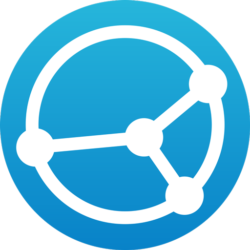</a></td>
<td valign="top"><a target="_blank" href="https://f-droid.org/en/packages/com.github.catfriend1.syncthingandroid"><strong>Syncthing-Fork</strong></a> 
synchroniseer en back-up bestanden <small><a target="_blank" href="https://github.com/PanderMusubi/foss/blob/main/README.md#syncthing">DT</a> <a target="_blank" href="https://alternativeto.net/software/syncthing/about/">AT</a></small></td>
<td valign="top"><strong>Dropbox, Google Drive, Microsoft OneDrive, Yandex Disk, Yandex Cloud</strong></td></tr>
f<tr id="{app["id"]}"><td></td>
<td valign="top"><a target="_blank" href="https://f-droid.org/en/packages/org.fossify.filemanager"><strong>Fossify File Manager</strong></a> 
beheer bestanden, ook bekijken PDF-bestanden <small></small></td>
<td valign="top"><strong></strong></td></tr>
f<tr id="{app["id"]}"><td></td>
<td valign="top"><a target="_blank" href="https://f-droid.org/en/packages/com.google.android.diskusage"><strong>DiskUsage</strong></a> 
beheer diskgebruik <small></small></td>
<td valign="top"><strong>Storage Analyzer & Disk Usage, CCleaner, AVG Cleaner</strong></td></tr>
<tr><th colspan="2"> Webbrowsers</th><th> Vervangt</th></tr>
f<tr id="{app["id"]}"><td></td>
<td valign="top"><a target="_blank" href="https://f-droid.org/en/packages/org.mozilla.fennec_fdroid"><strong>Fennec</strong></a> 
browse het internet met Firefox Mobile inclusief QR-scanner en Firefox Sync voor synchroniseren wachtwoorden, favorieten, instellingen, etc. <small><a target="_blank" href="https://github.com/PanderMusubi/foss/blob/main/README.md#firefox">DT</a> <a target="_blank" href="https://alternativeto.net/software/firefox/about/">AT</a></small></td>
<td valign="top"><strong>(Mozilla) Firefox, Google Chrome, Microsoft Edge, Opera, Samsung Internet Browser, Yandex Browser, Instapaper, Pocket</strong></td></tr>
f<tr id="{app["id"]}"><td><a target="_blank" href="https://f-droid.org/en/packages/org.liberty.android.freeotpplus">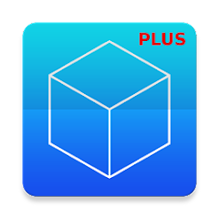</a></td>
<td valign="top"><a target="_blank" href="https://f-droid.org/en/packages/org.liberty.android.freeotpplus"><strong>FreeOTP+</strong></a> 
gebruik two-factor authenticatie (2FA) met import en export <small></small></td>
<td valign="top"><strong>Google Authenticator, Microsoft Authenticator, Authy</strong></td></tr>
f<tr id="{app["id"]}"><td></td>
<td valign="top"><a target="_blank" href="https://f-droid.org/en/packages/com.kunzisoft.keepass.libre"><strong>KeePassDX</strong></a> 
beheer wachtwoorden <small></small></td>
<td valign="top"><strong>Google Password Manager, Microsoft Authenticator, LastPass, 1Password, Bitwarden Password Manager, Yandex Key</strong></td></tr>
<tr><th colspan="2"> E-mail</th><th> Vervangt</th></tr>
f<tr id="{app["id"]}"><td></td>
<td valign="top"><a target="_blank" href="https://f-droid.org/en/packages/net.thunderbird.android"><strong>Thunderbird</strong></a> 
ontvang en verstuur e-mails <small><a target="_blank" href="https://github.com/PanderMusubi/foss/blob/main/README.md#thunderbird">DT</a> <a target="_blank" href="https://alternativeto.net/software/mozilla-thunderbird/about/">AT</a></small></td>
<td valign="top"><strong>Microsoft Outlook, (Google) Gmail, Yahoo Mail, Samsung Email, Yandex Mail</strong></td></tr>
f<tr id="{app["id"]}"><td></td>
<td valign="top"><a target="_blank" href="https://f-droid.org/en/packages/org.sufficientlysecure.keychain"><strong>OpenKeychain</strong></a> 
versleutel en ontsleutel teksten en bestanden (voor <strong>Thunderbird</strong>) <small></small></td>
<td valign="top"><strong></strong></td></tr>
<tr><th colspan="2"> Contacten, Kalenders en taken</th><th> Vervangt</th></tr>
f<tr id="{app["id"]}"><td></td>
<td valign="top"><a target="_blank" href="https://f-droid.org/en/packages/org.fossify.contacts"><strong>Fossify Contacts</strong></a> 
beheer contacten, ook van CardDAV <small><a target="_blank" href="https://github.com/PanderMusubi/foss/blob/main/README.md#thunderbird">DT</a></small></td>
<td valign="top"><strong></strong></td></tr>
f<tr id="{app["id"]}"><td></td>
<td valign="top"><a target="_blank" href="https://f-droid.org/en/packages/org.fossify.calendar"><strong>Fossify Calendar</strong></a> 
beheer kalenders, ook tonen feestdagen en verjaardagen (zie ook ICSx⁵ en DAVx⁵) <small><a target="_blank" href="https://github.com/PanderMusubi/foss/blob/main/README.md#thunderbird">DT</a></small></td>
<td valign="top"><strong>Google Calendar, Samsung Calendar, Microsoft Outlook, Yandex Calendar</strong></td></tr>
f<tr id="{app["id"]}"><td></td>
<td valign="top"><a target="_blank" href="https://f-droid.org/en/packages/at.bitfire.icsdroid"><strong>ICSx⁵</strong></a> 
voeg netwerkkalenders in ICS-formaat toe (aan <strong>Fossify Calendar</strong>) <small><a target="_blank" href="https://github.com/PanderMusubi/foss/blob/main/README.md#thunderbird">DT</a></small></td>
<td valign="top"><strong></strong></td></tr>
f<tr id="{app["id"]}"><td></td>
<td valign="top"><a target="_blank" href="https://f-droid.org/en/packages/at.bitfire.davdroid"><strong>DAVx⁵</strong></a> 
synchroniseer kalenders, taken en contacten in CalDAV en CardDav (met <strong>Fossify Calendar</strong>, <strong>Fossify Contacts</strong> en <strong>Tasks.org</strong>) <small><a target="_blank" href="https://github.com/PanderMusubi/foss/blob/main/README.md#thunderbird">DT</a></small></td>
<td valign="top"><strong></strong></td></tr>
f<tr id="{app["id"]}"><td></td>
<td valign="top"><a target="_blank" href="https://f-droid.org/en/packages/saschpe.contactevents"><strong> Birthday Calendar</strong></a> 
toon verjaardagen van <strong>Fossify Contacts</strong> in <strong>Fossify Calendar</strong>) <small><a target="_blank" href="https://github.com/PanderMusubi/foss/blob/main/README.md#thunderbird">DT</a></small></td>
<td valign="top"><strong></strong></td></tr>
f<tr id="{app["id"]}"><td></td>
<td valign="top"><a target="_blank" href="https://f-droid.org/en/packages/org.fossify.notes"><strong>Fossify Notes</strong></a> 
beheer taken, alleen lokaal <small><a target="_blank" href="https://github.com/PanderMusubi/foss/blob/main/README.md#thunderbird">DT</a></small></td>
<td valign="top"><strong>Google Keep, Microsoft OneNote, Evernote, Samsung Notes</strong></td></tr>
f<tr id="{app["id"]}"><td></td>
<td valign="top"><a target="_blank" href="https://f-droid.org/en/packages/org.tasks"><strong>Tasks.org</strong></a> 
beheer taken in CalDAV (zie ook <strong>DAVx⁵</strong>) <small><a target="_blank" href="https://github.com/PanderMusubi/foss/blob/main/README.md#thunderbird">DT</a></small></td>
<td valign="top"><strong></strong></td></tr>
f<tr id="{app["id"]}"><td></td>
<td valign="top"><a target="_blank" href="https://f-droid.org/en/packages/com.ichi2.anki"><strong>AnkiDroid</strong></a> 
studeer en synchroniseer flashcards in Anki <small><a target="_blank" href="https://github.com/PanderMusubi/foss/blob/main/README.md#yes">DT</a></small></td>
<td valign="top"><strong>Quizlet, Flashcards World, LingQ</strong></td></tr>
<tr><th colspan="2"> Messaging en communicatie</th><th> Vervangt</th></tr>
f<tr id="{app["id"]}"><td></td>
<td valign="top"><a target="_blank" href="https://f-droid.org/en/packages/org.fossify.messages"><strong>Fossify SMS Messenger</strong></a> 
beheer sms/mms-berichten <small></small></td>
<td valign="top"><strong>Google Messages</strong></td></tr>
f<tr id="{app["id"]}"><td></td>
<td valign="top"><a target="_blank" href="https://f-droid.org/en/packages/signal"><strong>Signal</strong></a> 
instant messaging, bellen en videobellen <small><a target="_blank" href="https://github.com/PanderMusubi/foss/blob/main/README.md#signal">DT</a> <a target="_blank" href="https://alternativeto.net/software/signal-private-messenger/about/">AT</a></small></td>
<td valign="top"><strong>WhatsApp, Facebook Messenger, Zoom, Discord, Google Meet, Google Hangouts, Instagram, Snapchat, LINE, Skype</strong></td></tr>
f<tr id="{app["id"]}"><td></td>
<td valign="top"><a target="_blank" href="https://f-droid.org/en/packages/org.forkgram.messenger"><strong>Forkgram (Telegram)</strong></a> 
instant messaging, bellen en videobellen <small><a target="_blank" href="https://github.com/PanderMusubi/foss/blob/main/README.md#telegram">DT</a> <a target="_blank" href="https://alternativeto.net/software/telegram/about/">AT</a></small></td>
<td valign="top"><strong>WhatsApp, Skype, Facebook Messenger, Discord, Google Hangouts, Instagram, Snapchat, LINE, Viber</strong></td></tr>
f<tr id="{app["id"]}"><td></td>
<td valign="top"><a target="_blank" href="https://f-droid.org/en/packages/org.briarproject.briar.android"><strong>Briar</strong></a> 
peer-to-peer messaging <small><a target="_blank" href="https://github.com/PanderMusubi/fdroid/blob/main/README.md#briar">MB</a> <a target="_blank" href="https://alternativeto.net/software/briar/about/">AT</a></small></td>
<td valign="top"><strong>WhatsApp, Facebook Messenger, Zoom, Discord, Google Meet, Google Hangouts, Instagram, Snapchat, LINE, Skype</strong></td></tr>
f<tr id="{app["id"]}"><td><a target="_blank" href="https://f-droid.org/en/packages/com.mattermost.rnbeta">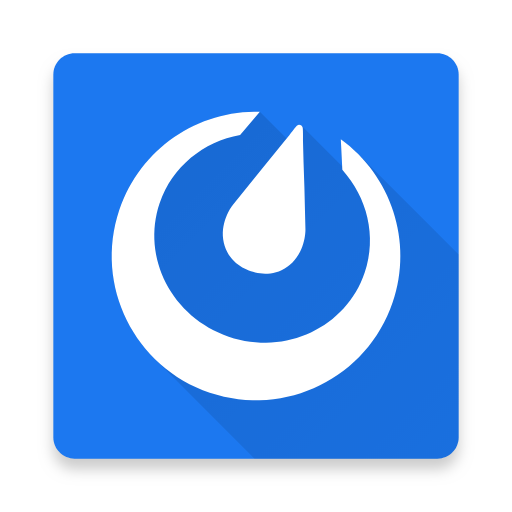</a></td>
<td valign="top"><a target="_blank" href="https://f-droid.org/en/packages/com.mattermost.rnbeta"><strong>Mattermost</strong></a> 
 <small><a target="_blank" href="https://github.com/PanderMusubi/foss/blob/main/README.md#mattermost">DT</a> <a target="_blank" href="https://alternativeto.net/software/mattermost/about/">AT</a></small></td>
<td valign="top"><strong></strong></td></tr>
f<tr id="{app["id"]}"><td><a target="_blank" href="https://f-droid.org/en/packages/im.vector.app">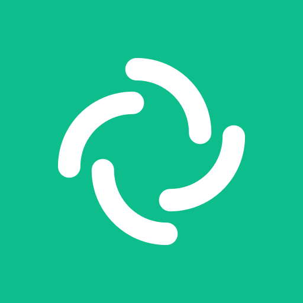</a></td>
<td valign="top"><a target="_blank" href="https://f-droid.org/en/packages/im.vector.app"><strong>Element</strong></a> 
instant messaging met Matrix <small><a target="_blank" href="https://github.com/PanderMusubi/foss/blob/main/README.md#element">DT</a> <a target="_blank" href="https://alternativeto.net/software/element-app/about/">AT</a></small></td>
<td valign="top"><strong>Viber</strong></td></tr>
f<tr id="{app["id"]}"><td><a target="_blank" href="https://f-droid.org/en/packages/io.element.android.x">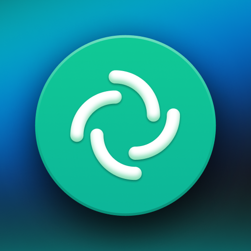</a></td>
<td valign="top"><a target="_blank" href="https://f-droid.org/en/packages/io.element.android.x"><strong>Element X</strong></a> 
instant messaging met Matrix <small><a target="_blank" href="https://github.com/PanderMusubi/foss/blob/main/README.md#element-x">DT</a></small></td>
<td valign="top"><strong>Viber</strong></td></tr>
f<tr id="{app["id"]}"><td></td>
<td valign="top"><a target="_blank" href="https://f-droid.org/en/packages/eu.siacs.conversations"><strong>Conversations</strong></a> 
instant messaging met XMPP <small></small></td>
<td valign="top"><strong></strong></td></tr>
f<tr id="{app["id"]}"><td><a target="_blank" href="https://f-droid.org/en/packages/io.heckel.ntfy">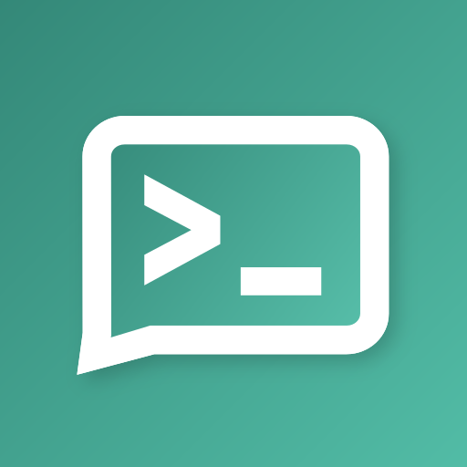</a></td>
<td valign="top"><a target="_blank" href="https://f-droid.org/en/packages/io.heckel.ntfy"><strong>nfty</strong></a> 
ontvang push-notificaties <small></small></td>
<td valign="top"><strong></strong></td></tr>
f<tr id="{app["id"]}"><td></td>
<td valign="top"><a target="_blank" href="https://f-droid.org/en/packages/org.linphone"><strong>Linphone</strong></a> 
bellen met VOIP <small></small></td>
<td valign="top"><strong></strong></td></tr>
f<tr id="{app["id"]}"><td><a target="_blank" href="https://f-droid.org/en/packages/org.avmedia.remotevideocam">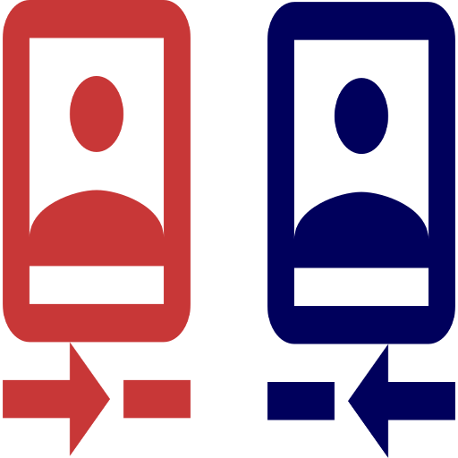</a></td>
<td valign="top"><a target="_blank" href="https://f-droid.org/en/packages/org.avmedia.remotevideocam"><strong>Remote Video Camera</strong></a> 
stream audio en/of video tussen twee apparaten <small></small></td>
<td valign="top"><strong></strong></td></tr>
f<tr id="{app["id"]}"><td></td>
<td valign="top"><a target="_blank" href="https://f-droid.org/en/packages/org.jitsi.meet"><strong>Jitsi Meet</strong></a> 
videoconferentie <small><a target="_blank" href="https://github.com/PanderMusubi/foss/blob/main/README.md#jitsi-meet">DT</a></small></td>
<td valign="top"><strong>Zoom, Microsoft Teams, Google Meet, Discord, Skype</strong></td></tr>
<tr><th colspan="2"> Video en afbeeldingen</th><th> Vervangt</th></tr>
f<tr id="{app["id"]}"><td></td>
<td valign="top"><a target="_blank" href="https://f-droid.org/en/packages/org.fossify.gallery"><strong>Fossify Gallery</strong></a> 
beheer afbeeldingen en video's <small></small></td>
<td valign="top"><strong>(Google) Pixel Camera</strong></td></tr>
f<tr id="{app["id"]}"><td></td>
<td valign="top"><a target="_blank" href="https://f-droid.org/en/packages/org.fossify.camera"><strong>Fossify Camera</strong></a> 
maak foto's en video's <small></small></td>
<td valign="top"><strong></strong></td></tr>
f<tr id="{app["id"]}"><td></td>
<td valign="top"><a target="_blank" href="https://f-droid.org/en/packages/org.schabi.newpipe"><strong>NewPipe</strong></a> 
speel YouTube, SoundCloud, Mixcloud, Bandcamp, etc. content af als video of audio, ook in de achtergrond <small></small></td>
<td valign="top"><strong>YouTube, SoundCloud, Mixcloud, Bandcamp</strong></td></tr>
f<tr id="{app["id"]}"><td></td>
<td valign="top"><a target="_blank" href="https://f-droid.org/en/packages/com.github.niqdev.ipcam"><strong>IPCam Demo</strong></a> 
bekijk IP=camerastreams <small></small></td>
<td valign="top"><strong></strong></td></tr>
f<tr id="{app["id"]}"><td></td>
<td valign="top"><a target="_blank" href="https://f-droid.org/en/packages/is.xyz.mpv"><strong>MPV</strong></a> 
speel video of audio af van bestanden of streams, inclusief dubbele ondertiteling <small><a target="_blank" href="https://github.com/PanderMusubi/foss/blob/main/README.md#mpv">DT</a></small></td>
<td valign="top"><strong></strong></td></tr>
f<tr id="{app["id"]}"><td></td>
<td valign="top"><a target="_blank" href="https://f-droid.org/en/packages/org.xbmc.kodi"><strong>Kodi</strong></a> 
speel video of audio af van bestanden of streams <small><a target="_blank" href="https://github.com/PanderMusubi/foss/blob/main/README.md#kodi">DT</a></small></td>
<td valign="top"><strong></strong></td></tr>
f<tr id="{app["id"]}"><td></td>
<td valign="top"><a target="_blank" href="https://f-droid.org/en/packages/org.xbmc.kore"><strong>Kore</strong></a> 
bedien op afstand Kodi <small></small></td>
<td valign="top"><strong></strong></td></tr>
<tr><th colspan="2"> Audio</th><th> Vervangt</th></tr>
f<tr id="{app["id"]}"><td></td>
<td valign="top"><a target="_blank" href="https://f-droid.org/en/packages/org.fossify.voicerecorder"><strong>Fossify Voice Recorder</strong></a> 
maak geluidsopnames <small></small></td>
<td valign="top"><strong>(Samsung) Voice Recorder, Samsung Notes</strong></td></tr>
f<tr id="{app["id"]}"><td></td>
<td valign="top"><a target="_blank" href="https://f-droid.org/en/packages/org.fossify.musicplayer"><strong>Fossify Music Player</strong></a> 
speel muziekbestanden af <small></small></td>
<td valign="top"><strong>Samsung Music, Apple Music, Mi Music</strong></td></tr>
f<tr id="{app["id"]}"><td></td>
<td valign="top"><a target="_blank" href="https://f-droid.org/en/packages/ch.blinkenlights.android.vanilla"><strong>Vanilla Music</strong></a> 
speel muziekbestanden af <small></small></td>
<td valign="top"><strong>Samsung Music, Apple Music, Mi Music</strong></td></tr>
f<tr id="{app["id"]}"><td></td>
<td valign="top"><a target="_blank" href="https://f-droid.org/en/packages/org.y20k.transistor"><strong>Transistor</strong></a> 
speel audiostreams af <small></small></td>
<td valign="top"><strong>Samsung Music, Apple Music, Mi Music</strong></td></tr>
f<tr id="{app["id"]}"><td></td>
<td valign="top"><a target="_blank" href="https://f-droid.org/en/packages/org.musicpd"><strong>MPD</strong></a> 
afstandsbediening voor MPD <small></small></td>
<td valign="top"><strong></strong></td></tr>
f<tr id="{app["id"]}"><td></td>
<td valign="top"><a target="_blank" href="https://f-droid.org/en/packages/org.gateshipone.malp"><strong>M.A.L.P.</strong></a> 
afstandsbediening voor MPD <small></small></td>
<td valign="top"><strong></strong></td></tr>
f<tr id="{app["id"]}"><td></td>
<td valign="top"><a target="_blank" href="https://f-droid.org/en/packages/de.danoeh.antennapod"><strong>AntennaPod</strong></a> 
podcasts <small></small></td>
<td valign="top"><strong>Apple Podcast, Yandex Podcasts</strong></td></tr>
f<tr id="{app["id"]}"><td></td>
<td valign="top"><a target="_blank" href="https://f-droid.org/en/packages/org.y20k.escapepod"><strong>Escapepod</strong></a> 
podcasts <small></small></td>
<td valign="top"><strong>Apple Podcast, Yandex Podcasts</strong></td></tr>
<tr><th colspan="2"> Routeplanning, navigatie, en reizen</th><th> Vervangt</th></tr>
f<tr id="{app["id"]}"><td></td>
<td valign="top"><a target="_blank" href="https://f-droid.org/en/packages/app.organicmaps"><strong>Organic Maps</strong></a> 
plan routes and nagiveer met OpenStreetMap voor lopen, fietsen en autorijden, oline en offline <small></small></td>
<td valign="top"><strong>Google Maps, Waze, TomTom, Yandex Maps, Yandex Navigator</strong></td></tr>
f<tr id="{app["id"]}"><td><a target="_blank" href="https://f-droid.org/en/packages/net.osmand.plus">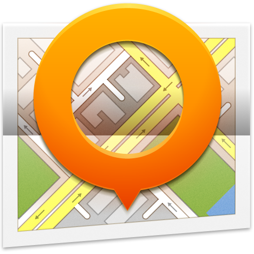</a></td>
<td valign="top"><a target="_blank" href="https://f-droid.org/en/packages/net.osmand.plus"><strong>OsmAnd</strong></a> 
plan routes and nagiveer met OpenStreetMap voor lopen, fietsen, autorijden en varen, oline en offline <small></small></td>
<td valign="top"><strong>Google Maps, Waze, TomTom, Yandex Maps, Yandex Navigator</strong></td></tr>
f<tr id="{app["id"]}"><td></td>
<td valign="top"><a target="_blank" href="https://f-droid.org/en/packages/de.grobox.liberario"><strong>Transportr</strong></a> 
plan openbaar vervoer met NS, 9292, etc. <small></small></td>
<td valign="top"><strong>Google Maps, Yandex Trains, 9292 (Netherlands), NS (Netherlands)</strong></td></tr>
f<tr id="{app["id"]}"><td><a target="_blank" href="https://f-droid.org/en/packages/net.vonforst.evmap">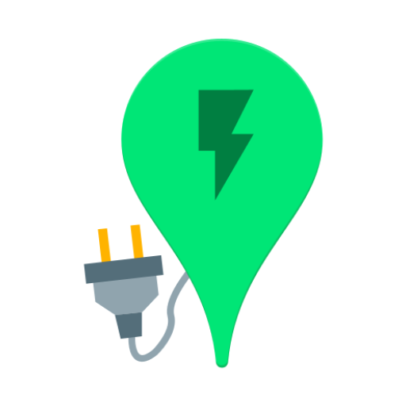</a></td>
<td valign="top"><a target="_blank" href="https://f-droid.org/en/packages/net.vonforst.evmap"><strong>EVMap</strong></a> 
vind opladers voor elektrische auto's op OpenStreetMap <small></small></td>
<td valign="top"><strong></strong></td></tr>
f<tr id="{app["id"]}"><td></td>
<td valign="top"><a target="_blank" href="https://f-droid.org/en/packages/net.gitsaibot.af"><strong>AF Weather Widget</strong></a> 
bekijk weersgrafieken in widgets <small></small></td>
<td valign="top"><strong>Google Weather, Yahoo Weather, Yandex Weather, Buienradar (Netherlands), KNMI (Netherlands)</strong></td></tr>
f<tr id="{app["id"]}"><td></td>
<td valign="top"><a target="_blank" href="https://f-droid.org/en/packages/org.ligi.passandroid"><strong>PassAndroid</strong></a> 
bekijk Passbookbestanden voor event- en reistickets <small></small></td>
<td valign="top"><strong>Google Wallet, WalletPasses</strong></td></tr>
<tr><th colspan="2"> Sociale Media</th><th> Vervangt</th></tr>
f<tr id="{app["id"]}"><td></td>
<td valign="top"><a target="_blank" href="https://f-droid.org/en/packages/com.keylesspalace.tusky"><strong>Tusky</strong></a> 
Mastodon <small></small></td>
<td valign="top"><strong></strong></td></tr>
f<tr id="{app["id"]}"><td></td>
<td valign="top"><a target="_blank" href="https://f-droid.org/en/packages/org.nuclearfog.twidda"><strong>Shitter</strong></a> 
Mastodon <small></small></td>
<td valign="top"><strong></strong></td></tr>
f<tr id="{app["id"]}"><td></td>
<td valign="top"><a target="_blank" href="https://f-droid.org/en/packages/com.twidere.twiderex"><strong>Twidere X</strong></a> 
Mastodon, etc. <small></small></td>
<td valign="top"><strong></strong></td></tr>
f<tr id="{app["id"]}"><td></td>
<td valign="top"><a target="_blank" href="https://f-droid.org/en/packages/it.rignanese.leo.slimfacebook"><strong>SlimSocial for Facebook</strong></a> 
Facebook <small></small></td>
<td valign="top"><strong></strong></td></tr>
<tr><th colspan="2"> Financieel</th><th> Vervangt</th></tr>
f<tr id="{app["id"]}"><td></td>
<td valign="top"><a target="_blank" href="https://f-droid.org/en/packages/org.btcmap"><strong>BTC Map</strong></a> 
vindt waar bitcoins uit te geven <small></small></td>
<td valign="top"><strong></strong></td></tr>
f<tr id="{app["id"]}"><td><a target="_blank" href="https://f-droid.org/en/packages/com.cointrend">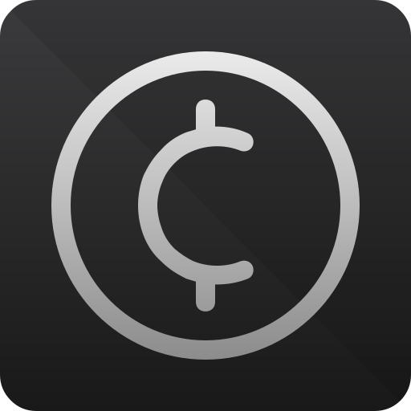</a></td>
<td valign="top"><a target="_blank" href="https://f-droid.org/en/packages/com.cointrend"><strong>CoinTrend</strong></a> 
bekijk cryptovalutaprijzen en - trends <small></small></td>
<td valign="top"><strong></strong></td></tr>
f<tr id="{app["id"]}"><td></td>
<td valign="top"><a target="_blank" href="https://f-droid.org/en/packages/hashengineering.darkcoin.wallet"><strong>Dash Wallet</strong></a> 
portemonnee cryptovaluta Dash <small><a target="_blank" href="https://github.com/PanderMusubi/foss/blob/main/README.md#dash">DT</a></small></td>
<td valign="top"><strong></strong></td></tr>
<tr><th colspan="2"> Randapparaten</th><th> Vervangt</th></tr>
f<tr id="{app["id"]}"><td></td>
<td valign="top"><a target="_blank" href="https://f-droid.org/en/packages/eu.darken.capod"><strong>CAPod</strong></a> 
gebruik oortjes zoals AirPods en Beats <small></small></td>
<td valign="top"><strong></strong></td></tr>
f<tr id="{app["id"]}"><td></td>
<td valign="top"><a target="_blank" href="https://f-droid.org/en/packages/nodomain.freeyourgadget.gadgetbridge"><strong>Gadgetbridge</strong></a> 
verbind met hartslagmonitors, draadloze oortjes en meer <small></small></td>
<td valign="top"><strong></strong></td></tr>
f<tr id="{app["id"]}"><td></td>
<td valign="top"><a target="_blank" href="https://f-droid.org/en/packages/org.openhab.habdroid"><strong>openHAB</strong></a> 
afstandsbediending huisautomatisering <small></small></td>
<td valign="top"><strong>SmartThings, Goolge Home, Smart Life, Nest</strong></td></tr>
f<tr id="{app["id"]}"><td><a target="_blank" href="https://f-droid.org/en/packages/io.homeassistant.companion.android.minimal">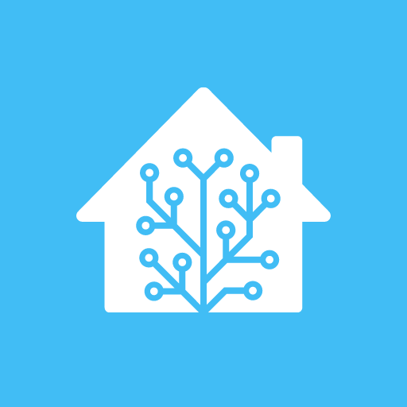</a></td>
<td valign="top"><a target="_blank" href="https://f-droid.org/en/packages/io.homeassistant.companion.android.minimal"><strong>Home Assistant</strong></a> 
afstandsbediending huisautomatisering <small></small></td>
<td valign="top"><strong>SmartThings, Goolge Home, Smart Life, Nest</strong></td></tr>
<tr><th colspan="2"> Netwerk</th><th> Vervangt</th></tr>
f<tr id="{app["id"]}"><td></td>
<td valign="top"><a target="_blank" href="https://f-droid.org/en/packages/ch.protonvpn.android"><strong>ProtonVPN</strong></a> 
gebruik gratis VPN <small></small></td>
<td valign="top"><strong></strong></td></tr>
f<tr id="{app["id"]}"><td></td>
<td valign="top"><a target="_blank" href="https://f-droid.org/en/packages/org.calyxinstitute.vpn"><strong>Calyx VPN</strong></a> 
gebruik gratis VPN zonder handmatige instellingen <small></small></td>
<td valign="top"><strong></strong></td></tr>
f<tr id="{app["id"]}"><td><a target="_blank" href="https://f-droid.org/en/packages/com.aaronjwood.portauthority">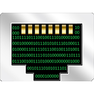</a></td>
<td valign="top"><a target="_blank" href="https://f-droid.org/en/packages/com.aaronjwood.portauthority"><strong>Port Authority</strong></a> 
scan LAN en poorten <small></small></td>
<td valign="top"><strong></strong></td></tr>
f<tr id="{app["id"]}"><td></td>
<td valign="top"><a target="_blank" href="https://f-droid.org/en/packages/com.vrem.wifianalyzer"><strong>WiFiAnalyzer</strong></a> 
optimaliseer wifinetwerken <small></small></td>
<td valign="top"><strong></strong></td></tr>
f<tr id="{app["id"]}"><td></td>
<td valign="top"><a target="_blank" href="https://f-droid.org/en/packages/org.connectbot"><strong>ConnectBot</strong></a> 
SSH en Telnet <small></small></td>
<td valign="top"><strong>Termius, JuiceSSH</strong></td></tr>
f<tr id="{app["id"]}"><td></td>
<td valign="top"><a target="_blank" href="https://f-droid.org/en/packages/com.manimarank.websitemonitor"><strong>Website Monitor</strong></a> 
monitor of websites online zijn <small></small></td>
<td valign="top"><strong></strong></td></tr>
<tr><th colspan="2"> Gezondheid</th><th> Vervangt</th></tr>
f<tr id="{app["id"]}"><td><a target="_blank" href="https://f-droid.org/en/packages/com.health.openscale">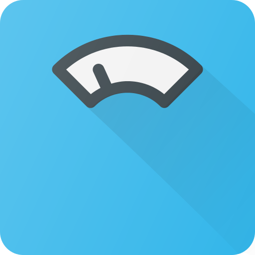</a></td>
<td valign="top"><a target="_blank" href="https://f-droid.org/en/packages/com.health.openscale"><strong>openScale</strong></a> 
houd gewicht en lichaamsmetingen bij <small></small></td>
<td valign="top"><strong>Google Fit, Samsung Health, (Google) Fitbit</strong></td></tr>
f<tr id="{app["id"]}"><td></td>
<td valign="top"><a target="_blank" href="https://f-droid.org/en/packages/org.runnerup.free"><strong>RunnerUp</strong></a> 
houd sportactiviteiten bij <small></small></td>
<td valign="top"><strong>Strava, adidas Running, Running App, Nike Run Club, ACICS Runkeeper</strong></td></tr>
f<tr id="{app["id"]}"><td></td>
<td valign="top"><a target="_blank" href="https://f-droid.org/en/packages/com.jithware.brethap"><strong>Brethap</strong></a> 
beheers je ademhaling tijdens meditatie <small></small></td>
<td valign="top"><strong></strong></td></tr>
f<tr id="{app["id"]}"><td></td>
<td valign="top"><a target="_blank" href="https://f-droid.org/en/packages/de.arnowelzel.android.periodical"><strong>Periodical</strong></a> 
houd vruchtbare dagen bij met Knaus-Oginomethode <small></small></td>
<td valign="top"><strong>Period Tracker, Flo Period, Clue Period</strong></td></tr>
<tr><th colspan="2"> Nederland</th><th> Vervangt</th></tr>
f<tr id="{app["id"]}"><td></td>
<td valign="top"><a target="_blank" href="https://f-droid.org/en/packages/com.anysoftkeyboard.languagepack.dutch_oss"><strong>AnySoftKeyboard Dutch</strong></a> 
Nederlandse ondersteuning voor AnySoftKeyboard <small></small></td>
<td valign="top"><strong>GBoard (Google Keyboard), Microsoft SwiftKey, Yandex Keyboard</strong></td></tr>
f<tr id="{app["id"]}"><td><a target="_blank" href="https://f-droid.org/en/packages/foss.cnugteren.nlweer">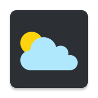</a></td>
<td valign="top"><a target="_blank" href="https://f-droid.org/en/packages/foss.cnugteren.nlweer"><strong>NLWeer</strong></a> 
Nederlands weer en neerslag van KNMI en Buienrader <small></small></td>
<td valign="top"><strong>Google Weather, Yahoo Weather, Yandex Weather, Buienradar, KNMI</strong></td></tr>
</table>

Als je nog een stap verder wil gaan, overweeg om [LineageOS](https://en.wikipedia.org/wiki/LineageOS) op je apparaat te installeren. Dit is Android zonder voorgeïnstalleerde apps van Google, zonder voorgeïnstalleerde apps van de fabrikant van je apparaat en zonder voorgeïnstalleerde apps van je provider. Door ook Open GApps pico te installeren heb je alsnog de mogelijkheid apps van Google Play te installeren, maar alleen die apps waar jij zelf voor kiest zoals Signal Private Messenger.

Zie ook:
- [Selectie van FOSS voor Windows, macOS en Linux](https://github.com/PanderMusubi/foss/blob/main/README-nl.md)
- [PRISM Break](https://prism-break.org/nl/)
- [Droid-Break](https://droid-break.info/)

Dit overzicht was gestarted in 2013 door [Hellebaard](http://hellebaard.nl) en was eerder dan die van PRISM Break en Droid-Break.

