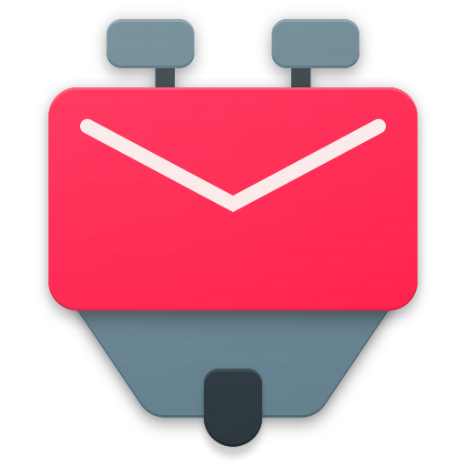
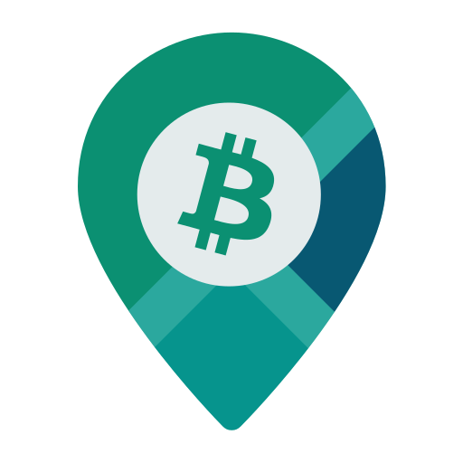
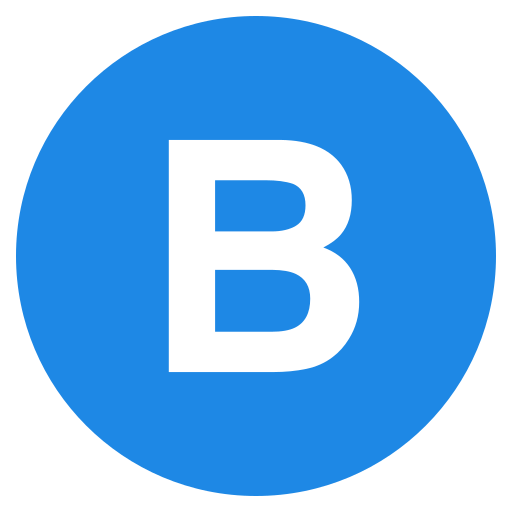

_🇬🇧 For English, see [README.md](README.md)_

_🇪🇸 Para español, ver [README-es.md](README-es.md)_

# F-Droid

**Selectie van FOSS Androidapps op F-Droid**

> <em>Zij die essentiële vrijheden opgeven om een beetje tijdelijke veiligheid te kopen, verdienen geen vrijheid noch veiligheid.</em> — Benjamin Franklin (1706 – 1790) Amerikaanse uitvinder, journalist, drukker, diplomaat en staatsman, Historisch overzicht van Pennsylvania, 1759

Veilige mobiele apps die je privacy respecteren en ongewenste reclames en trackers buiten de deur houden verdienen aandacht. Daarom wordt het gebruik van <a target="_blank" href="https://nl.wikipedia.org/wiki/Vrije_software_en_opensourcesoftware">vrije opensourcesoftware</a> (FOSS) aanbevolen, ook voor mobiele apparaten zoals smartphones en tablets.

Hieronder is een overzicht van gratis Anroidapps die vanuit [F-Droid](https://f-droid.org/) zijn te installeren. Dit is een veilige appstore die je privacy respecteerd. Veel van deze apps zijn ook van Google Play te installeren, maar de versies op F-Droid is tracking uit software verwijderd. Hierdoor laat je online een zo klein mogelijk digitaal spoor van je activiteiten achter.

Sommige van de apps in dit overzicht kosten geld op Google Play maar zijn gratis op F-Droid. Goed te weten is dat veel van deze apps soms beter zijn dan hun commerciele tegenhangers en dat notificaties ook aankomen op apparaten met WearOS die zijn verbonden.

<table>
<tr><th colspan="2"> Basis</th></tr>
<tr><td></td>
<td valign="top"><a target="_blank" href="https://f-droid.org/en/packages/org.fdroid.fdroid"><strong>F-Droid</strong></a> 
installeer apps uit de F-Droid appstore</td></tr>
<tr><td></td>
<td valign="top"><a target="_blank" href="https://f-droid.org/en/packages/com.simplemobiletools.dialer"><strong>Simple Dialer</strong></a> 
beheer telefoongesprekken</td></tr>
<tr><td></td>
<td valign="top"><a target="_blank" href="https://f-droid.org/en/packages/com.simplemobiletools.contacts.pro"><strong>Simple Contacts Pro</strong></a> 
beheer contacten in CardDAV</td></tr>
<tr><td></td>
<td valign="top"><a target="_blank" href="https://f-droid.org/en/packages/com.simplemobiletools.calculator"><strong>Simple Calculator</strong></a> 
make berekeningen</td></tr>
<tr><td></td>
<td valign="top"><a target="_blank" href="https://f-droid.org/en/packages/eu.darken.capod"><strong>CAPod</strong></a> 
gebruik oortjes zoals AirPods en Beats</td></tr>
<tr><td></td>
<td valign="top"><a target="_blank" href="https://f-droid.org/en/packages/com.simplemobiletools.keyboard"><strong>Simple Keyboard</strong></a> 
type met automatisch aanvullend toetsenbord</td></tr>
<tr><td></td>
<td valign="top"><a target="_blank" href="https://f-droid.org/en/packages/com.menny.android.anysoftkeyboard"><strong>AnySoftKeyboard</strong></a> 
type met automatisch aanvullend toetsenbord</td></tr>
<tr><td></td>
<td valign="top"><a target="_blank" href="https://f-droid.org/en/packages/nodomain.freeyourgadget.gadgetbridge"><strong>Gadgetbridge</strong></a> 
verbind met hartslagmonitors, draadloze oortjes en meer</td></tr>
<tr><td></td>
<td valign="top"><a target="_blank" href="https://f-droid.org/en/packages/de.nulide.findmydevice"><strong>FindMyDevice</strong></a> 
vind je misplaatste, verloren of gestolen apparaat</td></tr>
<tr><td></td>
<td valign="top"><a target="_blank" href="https://f-droid.org/en/packages/ru.seva.finder"><strong>Finder</strong></a> 
vind je misplaatste, verloren of gestolen apparaat</td></tr>
<tr><td></td>
<td valign="top"><a target="_blank" href="https://f-droid.org/en/packages/io.keepalive.android"><strong>Keep Alive</strong></a> 
verstuur sms met locatie na periode van inactiviteit</td></tr>
<tr><th colspan="2"> Webbrowsers</th></tr>
<tr><td></td>
<td valign="top"><a target="_blank" href="https://f-droid.org/en/packages/org.mozilla.fennec_fdroid"><strong>Fennec</strong></a> 
browse met Firefox Mobile inclusief QR scanner en Firefox Sync voor wachtwoordbeheer</td></tr>
<tr><td></td>
<td valign="top"><a target="_blank" href="https://f-droid.org/en/packages/org.liberty.android.freeotpplus"><strong>FreeOTP+</strong></a> 
gebruik two-factor authenticatie (2FA) met import en export</td></tr>
<tr><td></td>
<td valign="top"><a target="_blank" href="https://f-droid.org/en/packages/com.kunzisoft.keepass.libre"><strong>KeePassDX</strong></a> 
beheer wachtwoorden</td></tr>
<tr><td></td>
<td valign="top"><a target="_blank" href="https://f-droid.org/en/packages/com.nextcloudpasswords"><strong>NextcloudPasswords</strong></a> 
beheer en synchroniseer van wachtwoorden met Nextcloud</td></tr>
<tr><td></td>
<td valign="top"><a target="_blank" href="https://f-droid.org/en/packages/org.schabi.nxbookmarks"><strong>Nextcloud Bookmarks</strong></a> 
beheer en synchroniseer favorieten met Nextcloud</td></tr>
<tr><th colspan="2"> Messaging en communicatie</th></tr>
<tr><td></td>
<td valign="top"><a target="_blank" href="https://f-droid.org/en/packages/com.simplemobiletools.smsmessenger"><strong>Simple SMS Messenger</strong></a> 
beheer SMS-berichten</td></tr>
<tr><td></td>
<td valign="top"><a target="_blank" href="https://f-droid.org/en/packages/com.nextcloud.talk2"><strong>Nextcloud Talk</strong></a> 
videoconferentie met Nextcloud</td></tr>
<tr><td></td>
<td valign="top"><a target="_blank" href="https://f-droid.org/en/packages/org.telegram.messenger"><strong>Telegram</strong></a> 
instant messaging, bellen en videobellen</td></tr>
<tr><td></td>
<td valign="top"><a target="_blank" href="https://f-droid.org/en/packages/io.kuenzler.whatsappwebtogo"><strong>WhatsApp Web To Go</strong></a> 
web Whatsapp</td></tr>
<tr><td></td>
<td valign="top"><a target="_blank" href="https://f-droid.org/en/packages/im.vector.app"><strong>Element</strong></a> 
instant messaging met Matrix</td></tr>
<tr><td></td>
<td valign="top"><a target="_blank" href="https://f-droid.org/en/packages/eu.siacs.conversations"><strong>Conversations</strong></a> 
instant messaging met XMPP</td></tr>
<tr><td></td>
<td valign="top"><a target="_blank" href="https://f-droid.org/en/packages/com.example.deeplviewer"><strong>DeepL</strong></a> 
vertaal met DeepL, ook op geselecteerde tekst</td></tr>
<tr><td></td>
<td valign="top"><a target="_blank" href="https://f-droid.org/en/packages/io.heckel.ntfy"><strong>nfty</strong></a> 
ontvang push-notificaties</td></tr>
<tr><td></td>
<td valign="top"><a target="_blank" href="https://f-droid.org/en/packages/com.github.gotify"><strong>Gotify</strong></a> 
ontvang push-notificaties</td></tr>
<tr><td></td>
<td valign="top"><a target="_blank" href="https://f-droid.org/en/packages/org.linphone"><strong>Linphone</strong></a> 
bellen met VOIP</td></tr>
<tr><td></td>
<td valign="top"><a target="_blank" href="https://f-droid.org/en/packages/org.avmedia.remotevideocam"><strong>Remote Video Camera</strong></a> 
stream audio en/of video tussen twee apparaten</td></tr>
<tr><td></td>
<td valign="top"><a target="_blank" href="https://f-droid.org/en/packages/org.jitsi.meet"><strong>Jitsi Meet</strong></a> 
videoconferentie</td></tr>
<tr><th colspan="2"> Bestanden</th></tr>
<tr><td></td>
<td valign="top"><a target="_blank" href="https://f-droid.org/en/packages/com.simplemobiletools.filemanager.pro"><strong>Simple File Manager Pro</strong></a> 
beheer bestanden</td></tr>
<tr><td></td>
<td valign="top"><a target="_blank" href="https://f-droid.org/en/packages/com.nextcloud.client"><strong>Nextcloud</strong></a> 
synchroniseer bestanden met Nextcloud</td></tr>
<tr><td></td>
<td valign="top"><a target="_blank" href="https://f-droid.org/en/packages/com.github.vauvenal5.yaga"><strong>Yaga</strong></a> 
beheer en synchroniseer fotoalbums met Nextcloud</td></tr>
<tr><td></td>
<td valign="top"><a target="_blank" href="https://f-droid.org/en/packages/com.nutomic.syncthingandroid"><strong>Syncthing</strong></a> 
synchroniseer en back-up bestanden</td></tr>
<tr><td></td>
<td valign="top"><a target="_blank" href="https://f-droid.org/en/packages/com.github.catfriend1.syncthingandroid"><strong>Syncthing-Fork</strong></a> 
synchroniseer en back-up bestanden met extra features</td></tr>
<tr><td></td>
<td valign="top"><a target="_blank" href="https://f-droid.org/en/packages/com.google.android.diskusage"><strong>DiskUsage</strong></a> 
beheer diskgebruik</td></tr>
<tr><td></td>
<td valign="top"><a target="_blank" href="https://f-droid.org/en/packages/at.tomtasche.reader"><strong>LibreOffice document reader</strong></a> 
bekijk bestanden LibreOffice</td></tr>
<tr><td></td>
<td valign="top"><a target="_blank" href="https://f-droid.org/en/packages/com.gsnathan.pdfviewer"><strong>Pdf Viewer Plus</strong></a> 
bekijk PDF-bestanden (niet nodig als Simple File Manager Pro geïnstalleerd is)</td></tr>
<tr><th colspan="2"> Video en afbeeldingen</th></tr>
<tr><td></td>
<td valign="top"><a target="_blank" href="https://f-droid.org/en/packages/com.simplemobiletools.camera"><strong>Simple Camera</strong></a> 
maak foto's en video's</td></tr>
<tr><td></td>
<td valign="top"><a target="_blank" href="https://f-droid.org/en/packages/com.simplemobiletools.gallery.pro"><strong>Simple Gallery Pro</strong></a> 
beheer afbeeldingen en video's</td></tr>
<tr><td></td>
<td valign="top"><a target="_blank" href="https://f-droid.org/en/packages/org.schabi.newpipe"><strong>NewPipe</strong></a> 
speel YouTube, SoundCloud, Bandcamp, etc. content af als video of audio, ook in de achtergrond</td></tr>
<tr><td></td>
<td valign="top"><a target="_blank" href="https://f-droid.org/en/packages/cz.martykan.webtube"><strong>WebTube</strong></a> 
speel YouTube-content af als video of audio, ook in de achtergrond en inloggen is mogelijk</td></tr>
<tr><td></td>
<td valign="top"><a target="_blank" href="https://f-droid.org/en/packages/com.github.niqdev.ipcam"><strong>IPCam Demo</strong></a> 
bekijk IP=camerastreams</td></tr>
<tr><td></td>
<td valign="top"><a target="_blank" href="https://f-droid.org/en/packages/org.videolan.vlc"><strong>VLC</strong></a> 
speel video of audio af van bestanden of streams</td></tr>
<tr><td></td>
<td valign="top"><a target="_blank" href="https://f-droid.org/en/packages/org.xbmc.kodi"><strong>Kodi</strong></a> 
speel video of audio af van bestanden of streams</td></tr>
<tr><td></td>
<td valign="top"><a target="_blank" href="https://f-droid.org/en/packages/org.xbmc.kore"><strong>Kore</strong></a> 
afstandsbediening voor Kodi</td></tr>
<tr><th colspan="2"> E-mail</th></tr>
<tr><td></td>
<td valign="top"><a target="_blank" href="https://f-droid.org/en/packages/com.fsck.k9"><strong>K-9 Mail</strong></a> 
ontvang en verstuur e-mails</td></tr>
<tr><td></td>
<td valign="top"><a target="_blank" href="https://f-droid.org/en/packages/org.sufficientlysecure.keychain"><strong>OpenKeychain</strong></a> 
versleutel en ontsleutel teksten en bestanden voor K-9 Mail, etc.</td></tr>
<tr><th colspan="2"> Kalenders en taken</th></tr>
<tr><td></td>
<td valign="top"><a target="_blank" href="https://f-droid.org/en/packages/com.simplemobiletools.calendar.pro"><strong>Simple Calendar Pro</strong></a> 
beheer kalenders in CalDAV</td></tr>
<tr><td></td>
<td valign="top"><a target="_blank" href="https://f-droid.org/en/packages/ws.xsoh.etar"><strong>Etar</strong></a> 
beheer kalenders in CalDAV</td></tr>
<tr><td></td>
<td valign="top"><a target="_blank" href="https://f-droid.org/en/packages/at.bitfire.icsdroid"><strong>ICSx⁵</strong></a> 
voeg netwerkkalenders in ICS-formaat toe aan Simple Calendar Pro en Etar (zie ook de <a target="_blank" href="https://www.thunderbird.net/en-US/calendar/holidays/">Thunderbird Vakantiekalenders</a>)</td></tr>
<tr><td></td>
<td valign="top"><a target="_blank" href="https://f-droid.org/en/packages/saschpe.contactevents"><strong>Birthday Adapter</strong></a> 
voeg verjaardagen uit adresboek toe aan Simple Calendar Pro en Etar (zie ook voor <a target="_blank" href="https://addons.thunderbird.net/en-US/thunderbird/addon/thunderbirthday/">Thunderbird</a>)</td></tr>
<tr><td></td>
<td valign="top"><a target="_blank" href="https://f-droid.org/en/packages/at.bitfire.davdroid"><strong>DAVx⁵</strong></a> 
synchroniseer kalenders, taken en contacten in CalDAV en CardDav (zie ook voor <a target="_blank" href="https://addons.thunderbird.net/en-US/thunderbird/addon/dav-4-tbsync/">Thunderbird</a>)</td></tr>
<tr><td></td>
<td valign="top"><a target="_blank" href="https://f-droid.org/en/packages/com.woefe.shoppinglist"><strong>Shopping List</strong></a> 
beheer taken in bestanden</td></tr>
<tr><td></td>
<td valign="top"><a target="_blank" href="https://f-droid.org/en/packages/com.simplemobiletools.notes.pro"><strong>Simple Notes Pro</strong></a> 
beheer taken in CalDAV</td></tr>
<tr><td></td>
<td valign="top"><a target="_blank" href="https://f-droid.org/en/packages/org.tasks"><strong>Tasks.org</strong></a> 
beheer taken in CalDAV</td></tr>
<tr><td></td>
<td valign="top"><a target="_blank" href="https://f-droid.org/en/packages/com.ichi2.anki"><strong>AnkiDroid</strong></a> 
studeer en synchroniseer flashcards in Anki</td></tr>
<tr><td></td>
<td valign="top"><a target="_blank" href="https://f-droid.org/en/packages/it.niedermann.owncloud.notes"><strong>Notes</strong></a> 
beheer en synchroniseer aantekeningen met Nextcloud</td></tr>
<tr><td></td>
<td valign="top"><a target="_blank" href="https://f-droid.org/en/packages/it.niedermann.nextcloud.deck"><strong>Nextcloud Deck</strong></a> 
beheer en synchroniseer kanbankaarten met Nextcloud</td></tr>
<tr><th colspan="2"> Audio</th></tr>
<tr><td></td>
<td valign="top"><a target="_blank" href="https://f-droid.org/en/packages/com.simplemobiletools.voicerecorder"><strong>Simple Voice Recorder</strong></a> 
maak geluidsopnames</td></tr>
<tr><td></td>
<td valign="top"><a target="_blank" href="https://f-droid.org/en/packages/com.simplemobiletools.musicplayer"><strong>Simple Music Player</strong></a> 
speel muziekbestanden af</td></tr>
<tr><td></td>
<td valign="top"><a target="_blank" href="https://f-droid.org/en/packages/ch.blinkenlights.android.vanilla"><strong>Vanilla Music</strong></a> 
speel muziekbestanden af</td></tr>
<tr><td></td>
<td valign="top"><a target="_blank" href="https://f-droid.org/en/packages/org.y20k.transistor"><strong>Transistor</strong></a> 
speel audiostreams af</td></tr>
<tr><td></td>
<td valign="top"><a target="_blank" href="https://f-droid.org/en/packages/org.musicpd"><strong>MPD</strong></a> 
afstandsbediening voor MPD</td></tr>
<tr><td></td>
<td valign="top"><a target="_blank" href="https://f-droid.org/en/packages/org.gateshipone.malp"><strong>M.A.L.P.</strong></a> 
afstandsbediening voor MPD</td></tr>
<tr><td></td>
<td valign="top"><a target="_blank" href="https://f-droid.org/en/packages/de.danoeh.antennapod"><strong>AntennaPod</strong></a> 
podcasts</td></tr>
<tr><td></td>
<td valign="top"><a target="_blank" href="https://f-droid.org/en/packages/org.y20k.escapepod"><strong>Escapepod</strong></a> 
podcasts</td></tr>
<tr><td></td>
<td valign="top"><a target="_blank" href="https://f-droid.org/en/packages/com.shabinder.spotiflyer"><strong>SpotiFlyer</strong></a> 
download van o.a. Spotify, SoundCloud, YouTube</td></tr>
<tr><th colspan="2"> Routeplanning, navigatie, en reizen</th></tr>
<tr><td></td>
<td valign="top"><a target="_blank" href="https://f-droid.org/en/packages/net.eneiluj.nextcloud.phonetrack"><strong>PhoneTrack</strong></a> 
log en synchroniseer geolocaties in Nextcloud</td></tr>
<tr><td></td>
<td valign="top"><a target="_blank" href="https://f-droid.org/en/packages/app.organicmaps"><strong>Organic Maps</strong></a> 
plan routes and nagiveer met OpenStreetMap voor lopen, fietsen en autorijden, oline en offline</td></tr>
<tr><td></td>
<td valign="top"><a target="_blank" href="https://f-droid.org/en/packages/net.osmand.plus"><strong>OsmAnd</strong></a> 
plan routes and nagiveer met OpenStreetMap voor lopen, fietsen, autorijden en varen, oline en offline</td></tr>
<tr><td></td>
<td valign="top"><a target="_blank" href="https://f-droid.org/en/packages/de.grobox.liberario"><strong>Transportr</strong></a> 
plan openbaar vervoer met NS, 9292, etc.</td></tr>
<tr><td></td>
<td valign="top"><a target="_blank" href="https://f-droid.org/en/packages/de.westnordost.streetcomplete"><strong>StreetComplete</strong></a> 
vul OpenStreetMap op een eenvoudige manier aan</td></tr>
<tr><td></td>
<td valign="top"><a target="_blank" href="https://f-droid.org/en/packages/net.vonforst.evmap"><strong>EVMap</strong></a> 
vind opladers voor elektrische auto's op OpenStreetMap</td></tr>
<tr><td></td>
<td valign="top"><a target="_blank" href="https://f-droid.org/en/packages/com.google.android.stardroid"><strong>Sky Map</strong></a> 
verken sterren, planeten en meer in de hemel</td></tr>
<tr><td></td>
<td valign="top"><a target="_blank" href="https://f-droid.org/en/packages/net.gitsaibot.af"><strong>AF Weather Widget</strong></a> 
bekijk weersgrafieken in widgets</td></tr>
<tr><td></td>
<td valign="top"><a target="_blank" href="https://f-droid.org/en/packages/org.ligi.passandroid"><strong>PassAndroid</strong></a> 
bekijk Passbookbestanden voor event- en reistickets</td></tr>
<tr><th colspan="2"> Sociale media</th></tr>
<tr><td></td>
<td valign="top"><a target="_blank" href="https://f-droid.org/en/packages/com.keylesspalace.tusky"><strong>Tusky</strong></a> 
Mastodon</td></tr>
<tr><td></td>
<td valign="top"><a target="_blank" href="https://f-droid.org/en/packages/com.twidere.twiderex"><strong>Twidere X</strong></a> 
Mastodon, etc.</td></tr>
<tr><td></td>
<td valign="top"><a target="_blank" href="https://f-droid.org/en/packages/com.pitchedapps.frost"><strong>Frost for Facebook</strong></a> 
Facebook</td></tr>
<tr><td></td>
<td valign="top"><a target="_blank" href="https://f-droid.org/en/packages/it.rignanese.leo.slimfacebook"><strong>SlimSocial for Facebook</strong></a> 
Facebook</td></tr>
<tr><th colspan="2"> Financieel</th></tr>
<tr><td></td>
<td valign="top"><a target="_blank" href="https://f-droid.org/en/packages/org.btcmap"><strong>BTC Map</strong></a> 
vindt waar bitcoins uit te geven</td></tr>
<tr><td></td>
<td valign="top"><a target="_blank" href="https://f-droid.org/en/packages/eu.uwot.fabio.altcoinprices"><strong>Altcoin Prices</strong></a> 
prijzen en portfolio cryptovaluta's</td></tr>
<tr><td></td>
<td valign="top"><a target="_blank" href="https://f-droid.org/en/packages/de.cloneapps.crypto_prices"><strong>Crypto Prices</strong></a> 
prijzen en portfolio cryptovaluta's</td></tr>
<tr><td></td>
<td valign="top"><a target="_blank" href="https://f-droid.org/en/packages/hashengineering.darkcoin.wallet"><strong>Dash Wallet</strong></a> 
portemonnee cryptovaluta Dash</td></tr>
<tr><td></td>
<td valign="top"><a target="_blank" href="https://f-droid.org/en/packages/org.dash.electrum.electrum_dash"><strong>Dash Electrum</strong></a> 
portemonnee cryptovaluta Dash</td></tr>
<tr><td></td>
<td valign="top"><a target="_blank" href="https://f-droid.org/en/packages/org.walleth"><strong>WallETH</strong></a> 
portemonnee cryptovaluta Ethereum</td></tr>
<tr><th colspan="2"> Netwerk</th></tr>
<tr><td></td>
<td valign="top"><a target="_blank" href="https://f-droid.org/en/packages/ch.protonvpn.android"><strong>ProtonVPN</strong></a> 
gebruik gratis VPN</td></tr>
<tr><td></td>
<td valign="top"><a target="_blank" href="https://f-droid.org/en/packages/org.calyxinstitute.vpn"><strong>Calyx VPN</strong></a> 
gebruik gratis VPN zonder handmatige instellingen</td></tr>
<tr><td></td>
<td valign="top"><a target="_blank" href="https://f-droid.org/en/packages/com.aaronjwood.portauthority"><strong>Port Authority</strong></a> 
scan LAN en poorten</td></tr>
<tr><td></td>
<td valign="top"><a target="_blank" href="https://f-droid.org/en/packages/com.vrem.wifianalyzer"><strong>WiFiAnalyzer</strong></a> 
optimaliseer wifinetwerken</td></tr>
<tr><td></td>
<td valign="top"><a target="_blank" href="https://f-droid.org/en/packages/org.connectbot"><strong>ConnectBot</strong></a> 
SSH en Telnet</td></tr>
<tr><td></td>
<td valign="top"><a target="_blank" href="https://f-droid.org/en/packages/de.eidottermihi.raspicheck"><strong>Raspi Check</strong></a> 
beheer Raspberry Pi's</td></tr>
<tr><td></td>
<td valign="top"><a target="_blank" href="https://f-droid.org/en/packages/org.openhab.habdroid"><strong>openHAB</strong></a> 
afstandsbediending huisautomatisering</td></tr>
<tr><td></td>
<td valign="top"><a target="_blank" href="https://f-droid.org/en/packages/io.homeassistant.companion.android.minimal"><strong>Home Assistant</strong></a> 
afstandsbediending huisautomatisering</td></tr>
<tr><td></td>
<td valign="top"><a target="_blank" href="https://f-droid.org/en/packages/com.manimarank.websitemonitor"><strong>Website Monitor</strong></a> 
monitor of websites online zijn</td></tr>
<tr><th colspan="2"> Gezondheid</th></tr>
<tr><td></td>
<td valign="top"><a target="_blank" href="https://f-droid.org/en/packages/com.health.openscale"><strong>openScale</strong></a> 
houd gewicht en lichaamsmetingen bij</td></tr>
<tr><td></td>
<td valign="top"><a target="_blank" href="https://f-droid.org/en/packages/org.runnerup.free"><strong>RunnerUp</strong></a> 
houd sportactiviteiten bij</td></tr>
<tr><td></td>
<td valign="top"><a target="_blank" href="https://f-droid.org/en/packages/com.jithware.brethap"><strong>Brethap</strong></a> 
beheers je ademhaling tijdens meditatie</td></tr>
<tr><td></td>
<td valign="top"><a target="_blank" href="https://f-droid.org/en/packages/de.arnowelzel.android.periodical"><strong>Periodical</strong></a> 
houd vruchtbare dagen bij met Knaus-Oginomethode</td></tr>
<tr><td></td>
<td valign="top"><a target="_blank" href="https://f-droid.org/en/packages/flunzmas.seasoncalendar"><strong>Seasonal Foods Calendar</strong></a> 
vind regionaal seizoensvoedsel dat dichtbij is geproduceerd</td></tr>
<tr><th colspan="2"> Nederland</th></tr>
<tr><td></td>
<td valign="top"><a target="_blank" href="https://f-droid.org/en/packages/com.anysoftkeyboard.languagepack.dutch_oss"><strong>AnySoftKeyboard Dutch</strong></a> 
Nederlandse ondersteuning voor AnySoftKeyboard</td></tr>
<tr><td></td>
<td valign="top"><a target="_blank" href="https://f-droid.org/en/packages/foss.cnugteren.nlweer"><strong>NLWeer</strong></a> 
Nederlands weer en neerslag van KNMI en Buienrader</td></tr>
</table>

Als je nog een stap verder wil gaan, overweeg om [LineageOS](https://en.wikipedia.org/wiki/LineageOS) op je apparaat te installeren. Dit is Android zonder voorgeïnstalleerde apps van Google, zonder voorgeïnstalleerde apps van de fabrikant van je apparaat en zonder voorgeïnstalleerde apps van je provider. Door ook Open GApps pico te installeren heb je alsnog de mogelijkheid apps van Google Play te installeren, maar alleen die apps waar jij zelf voor kiest zoals Signal Private Messenger.

Zie ook:
- [Selectie van FOSS voor Windows, macOS en Linux](https://github.com/PanderMusubi/foss/blob/main/README-nl.md)
- [PRISM Break](https://prism-break.org/nl/)
- [Droid-Break](https://droid-break.info/)

Dit overzicht was gestarted in 2013 door [Hellebaard](http://hellebaard.nl) en was eerder dan die van PRISM Break en Droid-Break.

