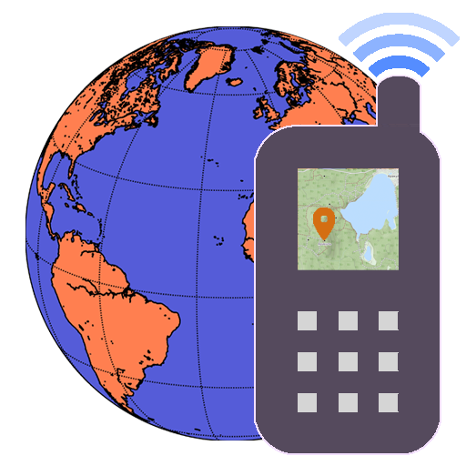
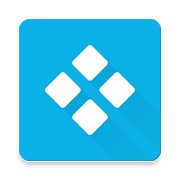

_🇬🇧 For English, see [README.md](README.md)_

_🇪🇸 Para español, ver [README-es.md](README-es.md)_

# F-Droid

**Selectie van FOSS Androidapps op F-Droid**

> <em>Zij die essentiële vrijheden opgeven om een beetje tijdelijke veiligheid te kopen, verdienen geen vrijheid noch veiligheid.</em> — Benjamin Franklin (1706 – 1790) Amerikaanse uitvinder, journalist, drukker, diplomaat en staatsman, Historisch overzicht van Pennsylvania, 1759

Veilige mobiele apps die je privacy respecteren en ongewenste reclames en trackers buiten de deur houden verdienen aandacht. Daarom wordt het gebruik van <a target="_blank" href="https://nl.wikipedia.org/wiki/Vrije_software_en_opensourcesoftware">vrije opensourcesoftware</a> (FOSS) aanbevolen, ook voor mobiele apparaten zoals smartphones en tablets.

Hieronder is een overzicht van gratis Anroidapps die vanuit <a target="_blank" href="https://f-droid.org/">F-Droid</a> zijn te installeren. Dit is een veilige appstore die je privacy respecteerd. Veel van deze apps zijn ook van Google Play te installeren, maar de versies op F-Droid is tracking uit software verwijderd. Hierdoor laat je online een zo klein mogelijk digitaal spoor van je activiteiten achter. Sommige van de apps in dit overzicht kosten geld op Google Play maar zijn gratis op F-Droid.

<table>
<tr><th colspan="2"> Basis</th></tr>
<tr><td></td>
<td valign="top"><a target="_blank" href="https://f-droid.org/en/packages/org.fdroid.fdroid"><strong>F-Droid</strong></a> 
appstore van F-Droid</td></tr>
<tr><td></td>
<td valign="top"><a target="_blank" href="https://f-droid.org/en/packages/com.menny.android.anysoftkeyboard"><strong>AnySoftKeyboard</strong></a> 
automatisch aanvullend toetsenbord</td></tr>
<tr><td></td>
<td valign="top"><a target="_blank" href="https://f-droid.org/en/packages/de.nulide.findmydevice"><strong>FindMyDevice</strong></a> 
vind je apparaat</td></tr>
<tr><td></td>
<td valign="top"><a target="_blank" href="https://f-droid.org/en/packages/ru.seva.finder"><strong>Finder</strong></a> 
vind je apparaat</td></tr>
<tr><th colspan="2"> Webbrowsers</th></tr>
<tr><td></td>
<td valign="top"><a target="_blank" href="https://f-droid.org/en/packages/org.mozilla.fennec_fdroid"><strong>Fennec</strong></a> 
webbrowser Firefox Mobile inclusief Firefox Sync, installeer handmatig de volgende add-ons</td></tr>
<tr><td></td>
<td valign="top"><a target="_blank" href="https://f-droid.org/en/packages/org.liberty.android.freeotpplus"><strong>FreeOTP+</strong></a> 
two-factor authenticatie (2FA) met import en export</td></tr>
<tr><td></td>
<td valign="top"><a target="_blank" href="https://f-droid.org/en/packages/com.kunzisoft.keepass.libre"><strong>KeePassDX</strong></a> 
wachtwoordbeheer</td></tr>
<tr><th colspan="2"> Messaging en communicatie</th></tr>
<tr><td></td>
<td valign="top"><a target="_blank" href="https://f-droid.org/en/packages/org.telegram.messenger"><strong>Telegram</strong></a> 
instant messaging</td></tr>
<tr><td></td>
<td valign="top"><a target="_blank" href="https://f-droid.org/en/packages/im.vector.app"><strong>Element (Riot.im)</strong></a> 
instant messaging op Matrix</td></tr>
<tr><td></td>
<td valign="top"><a target="_blank" href="https://f-droid.org/en/packages/eu.siacs.conversations"><strong>Conversations</strong></a> 
instant messaging met XMPP</td></tr>
<tr><td></td>
<td valign="top"><a target="_blank" href="https://f-droid.org/en/packages/org.jitsi.meet"><strong>Jitsi Meet</strong></a> 
videoconferantie</td></tr>
<tr><td></td>
<td valign="top"><a target="_blank" href="https://f-droid.org/en/packages/org.linphone"><strong>Linphone</strong></a> 
VOIP-telefoon</td></tr>
<tr><th colspan="2"> Nextcloud</th></tr>
<tr><td></td>
<td valign="top"><a target="_blank" href="https://f-droid.org/en/packages/com.nextcloud.client"><strong>Nextcloud</strong></a> 
synchroniseer bestanden</td></tr>
<tr><td></td>
<td valign="top"><a target="_blank" href="https://f-droid.org/en/packages/com.nextcloudpasswords"><strong>NextcloudPasswords</strong></a> 
beheer en synchroniseer wachtwoorden</td></tr>
<tr><td></td>
<td valign="top"><a target="_blank" href="https://f-droid.org/en/packages/com.nextcloud.talk2"><strong>Nextcloud Talk</strong></a> 
videoconferentie</td></tr>
<tr><td></td>
<td valign="top"><a target="_blank" href="https://f-droid.org/en/packages/it.niedermann.owncloud.notes"><strong>Notes</strong></a> 
beheer en synchroniseer aantekeningen</td></tr>
<tr><td></td>
<td valign="top"><a target="_blank" href="https://f-droid.org/en/packages/org.schabi.nxbookmarks"><strong>Nextcloud Bookmarks</strong></a> 
beheer en synchroniseer favorieten</td></tr>
<tr><td></td>
<td valign="top"><a target="_blank" href="https://f-droid.org/en/packages/it.niedermann.nextcloud.deck"><strong>Nextcloud Deck</strong></a> 
beheer en synchroniseer kanbankaarten</td></tr>
<tr><td></td>
<td valign="top"><a target="_blank" href="https://f-droid.org/en/packages/net.eneiluj.nextcloud.phonetrack"><strong>PhoneTrack</strong></a> 
log en upload posities</td></tr>
<tr><td></td>
<td valign="top"><a target="_blank" href="https://f-droid.org/en/packages/com.github.vauvenal5.yaga"><strong>Yaga</strong></a> 
beheer en synchroniseer foto's</td></tr>
<tr><th colspan="2"> Video</th></tr>
<tr><td></td>
<td valign="top"><a target="_blank" href="https://f-droid.org/en/packages/cz.martykan.webtube"><strong>WebTube</strong></a> 
YouTube, speelt ook in achtergrond en inloggen mogelijk</td></tr>
<tr><td></td>
<td valign="top"><a target="_blank" href="https://f-droid.org/en/packages/org.schabi.newpipe"><strong>NewPipe</strong></a> 
YouTube, speelt ook in achtergrond</td></tr>
<tr><td></td>
<td valign="top"><a target="_blank" href="https://f-droid.org/en/packages/org.videolan.vlc"><strong>VLC</strong></a> 
mediacenter</td></tr>
<tr><td></td>
<td valign="top"><a target="_blank" href="https://f-droid.org/en/packages/org.xbmc.kodi"><strong>Kodi</strong></a> 
mediacenter</td></tr>
<tr><td></td>
<td valign="top"><a target="_blank" href="https://f-droid.org/en/packages/org.xbmc.kore"><strong>Kore</strong></a> 
afstandsbediening Kodi</td></tr>
<tr><th colspan="2"> E-mail</th></tr>
<tr><td></td>
<td valign="top"><a target="_blank" href="https://f-droid.org/en/packages/com.fsck.k9"><strong>K-9 Mail</strong></a> 
e-mail</td></tr>
<tr><td></td>
<td valign="top"><a target="_blank" href="https://f-droid.org/en/packages/org.sufficientlysecure.keychain"><strong>OpenKeychain</strong></a> 
versleuteling voor K-9 Mail, etc.</td></tr>
<tr><th colspan="2"> Kalenders en taken</th></tr>
<tr><td></td>
<td valign="top"><a target="_blank" href="https://f-droid.org/en/packages/ws.xsoh.etar"><strong>Etar</strong></a> 
kalender</td></tr>
<tr><td></td>
<td valign="top"><a target="_blank" href="https://f-droid.org/en/packages/at.bitfire.icsdroid"><strong>ICSx⁵</strong></a> 
netwerkkalenders in ICS-formaat</td></tr>
<tr><td></td>
<td valign="top"><a target="_blank" href="https://f-droid.org/en/packages/saschpe.contactevents"><strong>Birthday Adapter</strong></a> 
verjaardagen uit adresboek <small>(zie ook voor <a target="_blank" href="https://addons.thunderbird.net/en-US/thunderbird/addon/thunderbirthday/">Thunderbird</a>)</small></td></tr>
<tr><td></td>
<td valign="top"><a target="_blank" href="https://f-droid.org/en/packages/com.woefe.shoppinglist"><strong>Shopping List</strong></a> 
taken in bestanden</td></tr>
<tr><td></td>
<td valign="top"><a target="_blank" href="https://f-droid.org/en/packages/org.tasks"><strong>Tasks.org</strong></a> 
taken in CalDAV</td></tr>
<tr><td></td>
<td valign="top"><a target="_blank" href="https://f-droid.org/en/packages/at.bitfire.davdroid"><strong>DAVx⁵</strong></a> 
synchronisatie kalenders, taken en contacten in CalDAV en CardDav <small>(zie ook voor <a target="_blank" href="https://addons.thunderbird.net/en-US/thunderbird/addon/dav-4-tbsync/">Thunderbird</a>)</small></td></tr>
<tr><th colspan="2"> Audio</th></tr>
<tr><td></td>
<td valign="top"><a target="_blank" href="https://f-droid.org/en/packages/org.y20k.transistor"><strong>Transistor</strong></a> 
audio stream player</td></tr>
<tr><td></td>
<td valign="top"><a target="_blank" href="https://f-droid.org/en/packages/ch.blinkenlights.android.vanilla"><strong>Vanilla Music</strong></a> 
muziekspeler</td></tr>
<tr><td></td>
<td valign="top"><a target="_blank" href="https://f-droid.org/en/packages/org.musicpd"><strong>MPD</strong></a> 
afstandsbediening MPD</td></tr>
<tr><td></td>
<td valign="top"><a target="_blank" href="https://f-droid.org/en/packages/org.gateshipone.malp"><strong>M.A.L.P.</strong></a> 
afstandsbediening MPD</td></tr>
<tr><td></td>
<td valign="top"><a target="_blank" href="https://f-droid.org/en/packages/de.danoeh.antennapod"><strong>AntennaPod</strong></a> 
podcasts</td></tr>
<tr><td></td>
<td valign="top"><a target="_blank" href="https://f-droid.org/en/packages/org.y20k.escapepod"><strong>Escapepod</strong></a> 
podcasts</td></tr>
<tr><td></td>
<td valign="top"><a target="_blank" href="https://f-droid.org/en/packages/com.shabinder.spotiflyer"><strong>SpotiFlyer</strong></a> 
download van o.a. Spotify, SoundCloud, YouTube</td></tr>
<tr><th colspan="2"> Navigatie en routeplanning</th></tr>
<tr><td></td>
<td valign="top"><a target="_blank" href="https://f-droid.org/en/packages/app.organicmaps"><strong>Organic Maps</strong></a> 
OpenStreetMap met navigatie en routeplanning lopend, fietsend en autorijdend, online én offline</td></tr>
<tr><td></td>
<td valign="top"><a target="_blank" href="https://f-droid.org/en/packages/net.osmand.plus"><strong>OsmAnd</strong></a> 
OpenStreetMap met navigatie en routeplanning lopend, fietsend, autorijdend en nautisch, online én offline</td></tr>
<tr><td></td>
<td valign="top"><a target="_blank" href="https://f-droid.org/en/packages/de.grobox.liberario"><strong>Transportr</strong></a> 
ov-reisplanner o.a. NS en 9292</td></tr>
<tr><td></td>
<td valign="top"><a target="_blank" href="https://f-droid.org/en/packages/de.westnordost.streetcomplete"><strong>StreetComplete</strong></a> 
eenvoudig aanvullen OpenStreetMap</td></tr>
<tr><td></td>
<td valign="top"><a target="_blank" href="https://f-droid.org/en/packages/com.google.android.stardroid"><strong>Sky Map</strong></a> 
verken de hemel</td></tr>
<tr><td></td>
<td valign="top"><a target="_blank" href="https://f-droid.org/en/packages/org.ligi.passandroid"><strong>PassAndroid</strong></a> 
bekijk Passbookbestanden</td></tr>
<tr><th colspan="2"> Sociale media</th></tr>
<tr><td></td>
<td valign="top"><a target="_blank" href="https://f-droid.org/en/packages/com.pitchedapps.frost"><strong>Frost for Facebook</strong></a> 
Facebook</td></tr>
<tr><td></td>
<td valign="top"><a target="_blank" href="https://f-droid.org/en/packages/it.rignanese.leo.slimfacebook"><strong>SlimSocial for Facebook</strong></a> 
Facebook</td></tr>
<tr><td></td>
<td valign="top"><a target="_blank" href="https://f-droid.org/en/packages/io.kuenzler.whatsappwebtogo"><strong>WhatsApp Web To Go</strong></a> 
web Whatsapp</td></tr>
<tr><td></td>
<td valign="top"><a target="_blank" href="https://f-droid.org/en/packages/com.twidere.twiderex"><strong>Twidere X</strong></a> 
Mastodon, etc.</td></tr>
<tr><td></td>
<td valign="top"><a target="_blank" href="https://f-droid.org/en/packages/com.keylesspalace.tusky"><strong>Tusky</strong></a> 
Mastodon</td></tr>
<tr><th colspan="2"> Bestanden</th></tr>
<tr><td></td>
<td valign="top"><a target="_blank" href="https://f-droid.org/en/packages/com.gsnathan.pdfviewer"><strong>Pdf Viewer Plus</strong></a> 
bekijk PDF-bestanden</td></tr>
<tr><td></td>
<td valign="top"><a target="_blank" href="https://f-droid.org/en/packages/at.tomtasche.reader"><strong>LibreOffice document reader</strong></a> 
bekijk bestanden LibreOffice</td></tr>
<tr><td></td>
<td valign="top"><a target="_blank" href="https://f-droid.org/en/packages/com.nutomic.syncthingandroid"><strong>Syncthing</strong></a> 
synchroniseer en back-up bestanden</td></tr>
<tr><td></td>
<td valign="top"><a target="_blank" href="https://f-droid.org/en/packages/com.google.android.diskusage"><strong>DiskUsage</strong></a> 
beheer diskgebruik</td></tr>
<tr><th colspan="2"> Financieel</th></tr>
<tr><td></td>
<td valign="top"><a target="_blank" href="https://f-droid.org/en/packages/eu.uwot.fabio.altcoinprices"><strong>Altcoin PRices</strong></a> 
prijzen en portfolio cryptovaluta's</td></tr>
<tr><td></td>
<td valign="top"><a target="_blank" href="https://f-droid.org/en/packages/de.cloneapps.crypto_prices"><strong>Crypto Prices</strong></a> 
prijzen en portfolio cryptovaluta's</td></tr>
<tr><td></td>
<td valign="top"><a target="_blank" href="https://f-droid.org/en/packages/hashengineering.darkcoin.wallet"><strong>Dash Wallet</strong></a> 
portemonnee cryptovaluta Dash</td></tr>
<tr><td></td>
<td valign="top"><a target="_blank" href="https://f-droid.org/en/packages/org.dash.electrum.electrum_dash"><strong>Dash Electrum</strong></a> 
portemonnee cryptovaluta Dash</td></tr>
<tr><td></td>
<td valign="top"><a target="_blank" href="https://f-droid.org/en/packages/org.walleth"><strong>WallETH</strong></a> 
portemonnee cryptovaluta Ethereum</td></tr>
<tr><th colspan="2"> Netwerk</th></tr>
<tr><td></td>
<td valign="top"><a target="_blank" href="https://f-droid.org/en/packages/ch.protonvpn.android"><strong>ProtonVPN</strong></a> 
veilige en gratis VPN</td></tr>
<tr><td></td>
<td valign="top"><a target="_blank" href="https://f-droid.org/en/packages/org.calyxinstitute.vpn"><strong>Calyx VPN</strong></a> 
gratis VPN zonder handmatige instellingen</td></tr>
<tr><td></td>
<td valign="top"><a target="_blank" href="https://f-droid.org/en/packages/de.csicar.ning"><strong>Ning</strong></a> 
LAN- en poortscanner</td></tr>
<tr><td></td>
<td valign="top"><a target="_blank" href="https://f-droid.org/en/packages/com.aaronjwood.portauthority"><strong>Port Authority</strong></a> 
LAN- en poortscanner</td></tr>
<tr><td></td>
<td valign="top"><a target="_blank" href="https://f-droid.org/en/packages/org.connectbot"><strong>ConnectBot</strong></a> 
SSH en Telnet</td></tr>
<tr><td></td>
<td valign="top"><a target="_blank" href="https://f-droid.org/en/packages/com.vrem.wifianalyzer"><strong>WiFiAnalyzer</strong></a> 
optimaliseer wifinetwerken</td></tr>
<tr><td></td>
<td valign="top"><a target="_blank" href="https://f-droid.org/en/packages/com.manimarank.websitemonitor"><strong>Website Monitor</strong></a> 
monitor websites</td></tr>
<tr><th colspan="2"> Gezondheid</th></tr>
<tr><td></td>
<td valign="top"><a target="_blank" href="https://f-droid.org/en/packages/com.health.openscale"><strong>openScale</strong></a> 
houd gewicht en lichaamsmetingen bij</td></tr>
<tr><td></td>
<td valign="top"><a target="_blank" href="https://f-droid.org/en/packages/org.runnerup.free"><strong>RunnerUp</strong></a> 
houd sportactiviteiten bij</td></tr>
<tr><td></td>
<td valign="top"><a target="_blank" href="https://f-droid.org/en/packages/flunzmas.seasoncalendar"><strong>easonal Foods Calendar</strong></a> 
vind regionaal seizoensvoedsel dat dichtbij is geproduceerd</td></tr>
<tr><th colspan="2"> Nederland</th></tr>
<tr><td></td>
<td valign="top"><a target="_blank" href="https://f-droid.org/en/packages/com.anysoftkeyboard.languagepack.dutch_oss"><strong>AnySoftKeyboard Dutch</strong></a> 
Nederlandse AnySoftKeyboard</td></tr>
<tr><td></td>
<td valign="top"><a target="_blank" href="https://f-droid.org/en/packages/foss.cnugteren.nlweer"><strong>NLWeer</strong></a> 
Nederlands weer en neerslag van KNMI en Buienrader</td></tr>
</table>

Als je nog een stap verder wil gaan, overweeg om <a target="_blank" href="https://en.wikipedia.org/wiki/LineageOS">LineageOS</a> op je apparaat te installeren. Dit is Android zonder voorgeïnstalleerde apps van Google, zonder voorgeïnstalleerde apps van de fabrikant van je apparaat en zonder voorgeïnstalleerde apps van je provider. Door ook Open GApps pico te installeren heb je alsnog de mogelijkheid apps van Google Play te installeren, maar alleen die apps waar jij zelf voor kiest zoals Signal Private Messenger.

Zie ook:
- [Selectie van FOSS voor Windows, macOS en Linux](https://github.com/PanderMusubi/foss/blob/main/README-nl.md)
- [PRISM Break](https://prism-break.org/nl/)
- [Droid-Break](https://droid-break.info/)

Dit overzicht was gestarted in 2013 door [Hellebaard](http://hellebaard.nl) en was eerder dan die van PRISM Break en Droid-Break.
