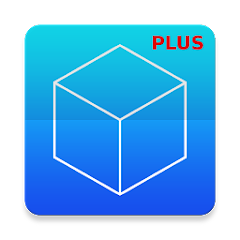

_🇪🇸 Para español, ver [README-es.md](README-es.md)_

_🇳🇱 Voor Nederlands, zie [README-nl.md](README-nl.md)_

# F-Droid

**Selection of FOSS Android apps on F-Droid**

> <em>Those who would give up essential liberty to purchase a little temporary safety, deserve neither liberty nor safety.</em> — Benjamin Franklin (1706 – 1790) American inventor, journalist, printer, diplomat and statesman, Historical Review of Pennsylvania, 1759

Safe mobile apps that respect your privacy and keep unwanted advertisements and trackers at bay, deserve extra attention. Hence, the use of <a target="_blank" href="https://en.wikipedia.org/wiki/Free_and_open-source_software">free and open source software</a> (FOSS) is advised, also for mobile devices such as smartphones and tablets.

Below is an overview of free Android apps which can be installed from [F-Droid](https://f-droid.org/). This is a safe app store that respects your privacy. Many apps can also be installed from Google Play, but the versions on F-Droid have tracking software removed. This minimizes the digital trail your online activity leaves behind.

Some of the apps listed here cost money in Google Play but are gratis on F-Droid. Good to know is that many of these apps often surpass their commercial counterparts in terms of functionality and performance.

The additional links under the application description are:
- AT for alternative.to
- OA for os.alternative.to

<table>
<tr><th colspan="2"> Basic</th><th> Replaces</th></tr>
<tr id="org.fdroid.fdroid"><td></td>
<td valign="top"><a target="_blank" href="https://f-droid.org/en/packages/org.fdroid.fdroid"><strong>F-Droid</strong></a> 
install apps from the F-Droid app store <small></small></td>
<td valign="top"><strong>Google Play, Amazon Appstore, (Samsung) Galaxy Store, Huawei AppGallery</strong></td></tr>
<tr id="org.fossify.clock"><td></td>
<td valign="top"><a target="_blank" href="https://f-droid.org/en/packages/org.fossify.clock"><strong>Fossify Clock</strong></a> 
manage alarms <small></small></td>
<td valign="top"><strong></strong></td></tr>
<tr id="org.fossify.phone"><td></td>
<td valign="top"><a target="_blank" href="https://f-droid.org/en/packages/org.fossify.phone"><strong>Fossify Phone</strong></a> 
manage phone calls <small></small></td>
<td valign="top"><strong></strong></td></tr>
<tr id="com.menny.android.anysoftkeyboard"><td></td>
<td valign="top"><a target="_blank" href="https://f-droid.org/en/packages/com.menny.android.anysoftkeyboard"><strong>AnySoftKeyboard</strong></a> 
type with autocompletion keyboard <small></small></td>
<td valign="top"><strong>GBoard (Google Keyboard), Microsoft SwiftKey, Yandex Keyboard</strong></td></tr>
<tr id="de.nulide.findmydevice"><td></td>
<td valign="top"><a target="_blank" href="https://f-droid.org/en/packages/de.nulide.findmydevice"><strong>FindMyDevice</strong></a> 
find your mistplaced, lost or stolen device <small></small></td>
<td valign="top"><strong>Google Find My Device, Samsung Find</strong></td></tr>
<tr id="ru.seva.finder"><td></td>
<td valign="top"><a target="_blank" href="https://f-droid.org/en/packages/ru.seva.finder"><strong>Finder</strong></a> 
find your mistplaced, lost or stolen device <small></small></td>
<td valign="top"><strong>Google Find My Device, Samsung Find</strong></td></tr>
<tr id="io.keepalive.android"><td></td>
<td valign="top"><a target="_blank" href="https://f-droid.org/en/packages/io.keepalive.android"><strong>Keep Alive</strong></a> 
send SMS with location after period of inactivity <small></small></td>
<td valign="top"><strong></strong></td></tr>
<tr><th colspan="2"> Files</th><th> Replaces</th></tr>
<tr id="com.github.catfriend1.syncthingandroid"><td></td>
<td valign="top"><a target="_blank" href="https://f-droid.org/en/packages/com.github.catfriend1.syncthingandroid"><strong>Syncthing-Fork</strong></a> 
synchronize and backup files <small><a target="_blank" href="https://github.com/PanderMusubi/foss/blob/main/README.md#syncthing">DT</a> <a target="_blank" href="https://alternativeto.net/software/syncthing/about/">AT</a></small></td>
<td valign="top"><strong>Dropbox, Google Drive, Microsoft OneDrive, Yandex Disk, Yandex Cloud</strong></td></tr>
<tr id="org.fossify.filemanager"><td></td>
<td valign="top"><a target="_blank" href="https://f-droid.org/en/packages/org.fossify.filemanager"><strong>Fossify File Manager</strong></a> 
manage files, also viewing PDF files <small></small></td>
<td valign="top"><strong></strong></td></tr>
<tr id="com.google.android.diskusage"><td></td>
<td valign="top"><a target="_blank" href="https://f-droid.org/en/packages/com.google.android.diskusage"><strong>DiskUsage</strong></a> 
manage disk usage <small></small></td>
<td valign="top"><strong>Storage Analyzer & Disk Usage, CCleaner, AVG Cleaner</strong></td></tr>
<tr><th colspan="2"> Web Browsers</th><th> Replaces</th></tr>
<tr id="org.mozilla.fennec_fdroid"><td></td>
<td valign="top"><a target="_blank" href="https://f-droid.org/en/packages/org.mozilla.fennec_fdroid"><strong>Fennec</strong></a> 
browse the internet with Firefox Mobile including QR scanner and Firefox Sync for synchronizing passwords, bookmarks, settings, etc. <small><a target="_blank" href="https://github.com/PanderMusubi/foss/blob/main/README.md#firefox">DT</a> <a target="_blank" href="https://alternativeto.net/software/firefox/about/">AT</a></small></td>
<td valign="top"><strong>(Mozilla) Firefox, Google Chrome, Microsoft Edge, Opera, Samsung Internet Browser, Yandex Browser, Instapaper, Pocket</strong></td></tr>
<tr id="org.liberty.android.freeotpplus"><td></td>
<td valign="top"><a target="_blank" href="https://f-droid.org/en/packages/org.liberty.android.freeotpplus"><strong>FreeOTP+</strong></a> 
use two-factor authentication (2FA) with import and export <small></small></td>
<td valign="top"><strong>Google Authenticator, Microsoft Authenticator, Authy</strong></td></tr>
<tr id="com.kunzisoft.keepass.libre"><td></td>
<td valign="top"><a target="_blank" href="https://f-droid.org/en/packages/com.kunzisoft.keepass.libre"><strong>KeePassDX</strong></a> 
manage passwords <small></small></td>
<td valign="top"><strong>Google Password Manager, Microsoft Authenticator, LastPass, 1Password, Bitwarden Password Manager, Yandex Key</strong></td></tr>
<tr><th colspan="2"> Email</th><th> Replaces</th></tr>
<tr id="net.thunderbird.android"><td></td>
<td valign="top"><a target="_blank" href="https://f-droid.org/en/packages/net.thunderbird.android"><strong>Thunderbird</strong></a> 
send and receive emails <small><a target="_blank" href="https://github.com/PanderMusubi/foss/blob/main/README.md#thunderbird">DT</a> <a target="_blank" href="https://alternativeto.net/software/mozilla-thunderbird/about/">AT</a></small></td>
<td valign="top"><strong>Microsoft Outlook, (Google) Gmail, Yahoo Mail, Samsung Email, Yandex Mail</strong></td></tr>
<tr id="org.sufficientlysecure.keychain"><td></td>
<td valign="top"><a target="_blank" href="https://f-droid.org/en/packages/org.sufficientlysecure.keychain"><strong>OpenKeychain</strong></a> 
encrypt and decrypt texts and files (for <strong>Thunderbird</strong>) <small></small></td>
<td valign="top"><strong></strong></td></tr>
<tr><th colspan="2"> Contacts, Calendars and Tasks</th><th> Replaces</th></tr>
<tr id="org.fossify.contacts"><td></td>
<td valign="top"><a target="_blank" href="https://f-droid.org/en/packages/org.fossify.contacts"><strong>Fossify Contacts</strong></a> 
manage contacts, also from CardDAV <small><a target="_blank" href="https://github.com/PanderMusubi/foss/blob/main/README.md#thunderbird">DT</a></small></td>
<td valign="top"><strong></strong></td></tr>
<tr id="org.fossify.calendar"><td></td>
<td valign="top"><a target="_blank" href="https://f-droid.org/en/packages/org.fossify.calendar"><strong>Fossify Calendar</strong></a> 
manage calendars, also showing holidays and birthdays (see also ICSx⁵ and DAVx⁵) <small><a target="_blank" href="https://github.com/PanderMusubi/foss/blob/main/README.md#thunderbird">DT</a></small></td>
<td valign="top"><strong>Google Calendar, Samsung Calendar, Microsoft Outlook, Yandex Calendar</strong></td></tr>
<tr id="at.bitfire.icsdroid"><td></td>
<td valign="top"><a target="_blank" href="https://f-droid.org/en/packages/at.bitfire.icsdroid"><strong>ICSx⁵</strong></a> 
add network calendars in ICS format (to <strong>Fossify Calendar</strong>) <small><a target="_blank" href="https://github.com/PanderMusubi/foss/blob/main/README.md#thunderbird">DT</a></small></td>
<td valign="top"><strong></strong></td></tr>
<tr id="at.bitfire.davdroid"><td></td>
<td valign="top"><a target="_blank" href="https://f-droid.org/en/packages/at.bitfire.davdroid"><strong>DAVx⁵</strong></a> 
synchronize calendars, tasks and contacts in CalDAV and CardDav (with <strong>Fossify Calendar</strong>, <strong>Fossify Contacts</strong> and <strong>Tasks.org</strong>) <small><a target="_blank" href="https://github.com/PanderMusubi/foss/blob/main/README.md#thunderbird">DT</a></small></td>
<td valign="top"><strong></strong></td></tr>
<tr id="saschpe.contactevents"><td></td>
<td valign="top"><a target="_blank" href="https://f-droid.org/en/packages/saschpe.contactevents"><strong> Birthday Calendar</strong></a> 
show birthdays from <strong>Fossify Contacts</strong> in <strong>Fossify Calendar</strong>,  and <strong>Tasks.org</strong>) <small><a target="_blank" href="https://github.com/PanderMusubi/foss/blob/main/README.md#thunderbird">DT</a></small></td>
<td valign="top"><strong></strong></td></tr>
<tr id="org.fossify.notes"><td></td>
<td valign="top"><a target="_blank" href="https://f-droid.org/en/packages/org.fossify.notes"><strong>Fossify Notes</strong></a> 
manage tasks, only locally <small><a target="_blank" href="https://github.com/PanderMusubi/foss/blob/main/README.md#thunderbird">DT</a></small></td>
<td valign="top"><strong>Google Keep, Microsoft OneNote, Evernote, Samsung Notes</strong></td></tr>
<tr id="org.tasks"><td></td>
<td valign="top"><a target="_blank" href="https://f-droid.org/en/packages/org.tasks"><strong>Tasks.org</strong></a> 
manage tasks in CalDAV (see also <strong>DAVx⁵</strong>) <small><a target="_blank" href="https://github.com/PanderMusubi/foss/blob/main/README.md#thunderbird">DT</a></small></td>
<td valign="top"><strong></strong></td></tr>
<tr id="com.ichi2.anki"><td></td>
<td valign="top"><a target="_blank" href="https://f-droid.org/en/packages/com.ichi2.anki"><strong>AnkiDroid</strong></a> 
study and synchronize flashcards in Anki <small><a target="_blank" href="https://github.com/PanderMusubi/foss/blob/main/README.md#yes">DT</a></small></td>
<td valign="top"><strong>Quizlet, Flashcards World, LingQ</strong></td></tr>
<tr><th colspan="2"> Messaging and Communication</th><th> Replaces</th></tr>
<tr id="org.fossify.messages"><td></td>
<td valign="top"><a target="_blank" href="https://f-droid.org/en/packages/org.fossify.messages"><strong>Fossify SMS Messenger</strong></a> 
manage SMS/MMS messages <small></small></td>
<td valign="top"><strong>Google Messages</strong></td></tr>
<tr id="signal"><td></td>
<td valign="top"><a target="_blank" href="https://f-droid.org/en/packages/signal"><strong>Signal</strong></a> 
instant messaging, voice and video calling <small><a target="_blank" href="https://github.com/PanderMusubi/foss/blob/main/README.md#signal">DT</a> <a target="_blank" href="https://alternativeto.net/software/signal-private-messenger/about/">AT</a></small></td>
<td valign="top"><strong>WhatsApp, Facebook Messenger, Zoom, Discord, Google Meet, Google Hangouts, Instagram, Snapchat, LINE, Skype</strong></td></tr>
<tr id="org.forkgram.messenger"><td></td>
<td valign="top"><a target="_blank" href="https://f-droid.org/en/packages/org.forkgram.messenger"><strong>Forkgram (Telegram)</strong></a> 
instant messaging, voice and video calling <small><a target="_blank" href="https://github.com/PanderMusubi/foss/blob/main/README.md#telegram">DT</a> <a target="_blank" href="https://alternativeto.net/software/telegram/about/">AT</a></small></td>
<td valign="top"><strong>WhatsApp, Skype, Facebook Messenger, Discord, Google Hangouts, Instagram, Snapchat, LINE, Viber</strong></td></tr>
<tr id="org.briarproject.briar.android"><td></td>
<td valign="top"><a target="_blank" href="https://f-droid.org/en/packages/org.briarproject.briar.android"><strong>Briar</strong></a> 
peer-to-peer messaging <small><a target="_blank" href="https://github.com/PanderMusubi/fdroid/blob/main/README.md#briar">MB</a> <a target="_blank" href="https://alternativeto.net/software/briar/about/">AT</a></small></td>
<td valign="top"><strong>WhatsApp, Facebook Messenger, Zoom, Discord, Google Meet, Google Hangouts, Instagram, Snapchat, LINE, Skype</strong></td></tr>
<tr id="com.mattermost.rnbeta"><td></td>
<td valign="top"><a target="_blank" href="https://f-droid.org/en/packages/com.mattermost.rnbeta"><strong>Mattermost</strong></a> 
 <small><a target="_blank" href="https://github.com/PanderMusubi/foss/blob/main/README.md#mattermost">DT</a> <a target="_blank" href="https://alternativeto.net/software/mattermost/about/">AT</a></small></td>
<td valign="top"><strong></strong></td></tr>
<tr id="im.vector.app"><td></td>
<td valign="top"><a target="_blank" href="https://f-droid.org/en/packages/im.vector.app"><strong>Element</strong></a> 
instant messaging with Matrix <small><a target="_blank" href="https://github.com/PanderMusubi/foss/blob/main/README.md#element">DT</a> <a target="_blank" href="https://alternativeto.net/software/element-app/about/">AT</a></small></td>
<td valign="top"><strong>Viber</strong></td></tr>
<tr id="io.element.android.x"><td></td>
<td valign="top"><a target="_blank" href="https://f-droid.org/en/packages/io.element.android.x"><strong>Element X</strong></a> 
instant messaging with Matrix <small><a target="_blank" href="https://github.com/PanderMusubi/foss/blob/main/README.md#element-x">DT</a></small></td>
<td valign="top"><strong>Viber</strong></td></tr>
<tr id="eu.siacs.conversations"><td></td>
<td valign="top"><a target="_blank" href="https://f-droid.org/en/packages/eu.siacs.conversations"><strong>Conversations</strong></a> 
instant messaging with XMPP <small></small></td>
<td valign="top"><strong></strong></td></tr>
<tr id="io.heckel.ntfy"><td></td>
<td valign="top"><a target="_blank" href="https://f-droid.org/en/packages/io.heckel.ntfy"><strong>nfty</strong></a> 
receive push notifications <small></small></td>
<td valign="top"><strong></strong></td></tr>
<tr id="org.linphone"><td></td>
<td valign="top"><a target="_blank" href="https://f-droid.org/en/packages/org.linphone"><strong>Linphone</strong></a> 
calling with VOIP <small></small></td>
<td valign="top"><strong></strong></td></tr>
<tr id="org.avmedia.remotevideocam"><td></td>
<td valign="top"><a target="_blank" href="https://f-droid.org/en/packages/org.avmedia.remotevideocam"><strong>Remote Video Camera</strong></a> 
stream audio and/or video between two devices <small></small></td>
<td valign="top"><strong></strong></td></tr>
<tr id="org.jitsi.meet"><td></td>
<td valign="top"><a target="_blank" href="https://f-droid.org/en/packages/org.jitsi.meet"><strong>Jitsi Meet</strong></a> 
video conference <small><a target="_blank" href="https://github.com/PanderMusubi/foss/blob/main/README.md#jitsi-meet">DT</a></small></td>
<td valign="top"><strong>Zoom, Microsoft Teams, Google Meet, Discord, Skype</strong></td></tr>
<tr><th colspan="2"> Video and Images</th><th> Replaces</th></tr>
<tr id="org.fossify.gallery"><td></td>
<td valign="top"><a target="_blank" href="https://f-droid.org/en/packages/org.fossify.gallery"><strong>Fossify Gallery</strong></a> 
manage images and videos <small></small></td>
<td valign="top"><strong>(Google) Pixel Camera</strong></td></tr>
<tr id="org.fossify.camera"><td></td>
<td valign="top"><a target="_blank" href="https://f-droid.org/en/packages/org.fossify.camera"><strong>Fossify Camera</strong></a> 
make photographs and videos <small></small></td>
<td valign="top"><strong></strong></td></tr>
<tr id="org.schabi.newpipe"><td></td>
<td valign="top"><a target="_blank" href="https://f-droid.org/en/packages/org.schabi.newpipe"><strong>NewPipe</strong></a> 
play YouTube, SoundCloud, Mixcloud, Bandcamp, etc. content as video or audio, also in the background <small></small></td>
<td valign="top"><strong>YouTube, SoundCloud, Mixcloud, Bandcamp</strong></td></tr>
<tr id="com.github.niqdev.ipcam"><td></td>
<td valign="top"><a target="_blank" href="https://f-droid.org/en/packages/com.github.niqdev.ipcam"><strong>IPCam Demo</strong></a> 
view IP camera streamss <small></small></td>
<td valign="top"><strong></strong></td></tr>
<tr id="is.xyz.mpv"><td></td>
<td valign="top"><a target="_blank" href="https://f-droid.org/en/packages/is.xyz.mpv"><strong>MPV</strong></a> 
play video or audio from files or streams, including dual subtitles <small><a target="_blank" href="https://github.com/PanderMusubi/foss/blob/main/README.md#mpv">DT</a></small></td>
<td valign="top"><strong></strong></td></tr>
<tr id="org.xbmc.kodi"><td></td>
<td valign="top"><a target="_blank" href="https://f-droid.org/en/packages/org.xbmc.kodi"><strong>Kodi</strong></a> 
play video or audio from files or streams <small><a target="_blank" href="https://github.com/PanderMusubi/foss/blob/main/README.md#kodi">DT</a></small></td>
<td valign="top"><strong></strong></td></tr>
<tr id="org.xbmc.kore"><td></td>
<td valign="top"><a target="_blank" href="https://f-droid.org/en/packages/org.xbmc.kore"><strong>Kore</strong></a> 
remote control Kodi <small></small></td>
<td valign="top"><strong></strong></td></tr>
<tr><th colspan="2"> Audio</th><th> Replaces</th></tr>
<tr id="org.fossify.voicerecorder"><td></td>
<td valign="top"><a target="_blank" href="https://f-droid.org/en/packages/org.fossify.voicerecorder"><strong>Fossify Voice Recorder</strong></a> 
make audio recordings <small></small></td>
<td valign="top"><strong>(Samsung) Voice Recorder, Samsung Notes</strong></td></tr>
<tr id="org.fossify.musicplayer"><td></td>
<td valign="top"><a target="_blank" href="https://f-droid.org/en/packages/org.fossify.musicplayer"><strong>Fossify Music Player</strong></a> 
play music files <small></small></td>
<td valign="top"><strong>Samsung Music, Apple Music, Mi Music</strong></td></tr>
<tr id="ch.blinkenlights.android.vanilla"><td></td>
<td valign="top"><a target="_blank" href="https://f-droid.org/en/packages/ch.blinkenlights.android.vanilla"><strong>Vanilla Music</strong></a> 
play music files <small></small></td>
<td valign="top"><strong>Samsung Music, Apple Music, Mi Music</strong></td></tr>
<tr id="org.y20k.transistor"><td></td>
<td valign="top"><a target="_blank" href="https://f-droid.org/en/packages/org.y20k.transistor"><strong>Transistor</strong></a> 
play audio streams <small></small></td>
<td valign="top"><strong>Samsung Music, Apple Music, Mi Music</strong></td></tr>
<tr id="org.musicpd"><td></td>
<td valign="top"><a target="_blank" href="https://f-droid.org/en/packages/org.musicpd"><strong>MPD</strong></a> 
remote control for MPD <small></small></td>
<td valign="top"><strong></strong></td></tr>
<tr id="org.gateshipone.malp"><td></td>
<td valign="top"><a target="_blank" href="https://f-droid.org/en/packages/org.gateshipone.malp"><strong>M.A.L.P.</strong></a> 
remote control for MPD <small></small></td>
<td valign="top"><strong></strong></td></tr>
<tr id="de.danoeh.antennapod"><td></td>
<td valign="top"><a target="_blank" href="https://f-droid.org/en/packages/de.danoeh.antennapod"><strong>AntennaPod</strong></a> 
podcasts <small></small></td>
<td valign="top"><strong>Apple Podcast, Yandex Podcasts</strong></td></tr>
<tr id="org.y20k.escapepod"><td></td>
<td valign="top"><a target="_blank" href="https://f-droid.org/en/packages/org.y20k.escapepod"><strong>Escapepod</strong></a> 
podcasts <small></small></td>
<td valign="top"><strong>Apple Podcast, Yandex Podcasts</strong></td></tr>
<tr><th colspan="2"> Route Planning, Navigation and Travel</th><th> Replaces</th></tr>
<tr id="app.organicmaps"><td></td>
<td valign="top"><a target="_blank" href="https://f-droid.org/en/packages/app.organicmaps"><strong>Organic Maps</strong></a> 
plan routes and navigate with OpenStreetMap for walking, cycling and driving, online and offline <small></small></td>
<td valign="top"><strong>Google Maps, Waze, TomTom, Yandex Maps, Yandex Navigator</strong></td></tr>
<tr id="net.osmand.plus"><td></td>
<td valign="top"><a target="_blank" href="https://f-droid.org/en/packages/net.osmand.plus"><strong>OsmAnd</strong></a> 
plan routes and navigate with OpenStreetMap for walking, cycling, driving and sailing, online and offline <small></small></td>
<td valign="top"><strong>Google Maps, Waze, TomTom, Yandex Maps, Yandex Navigator</strong></td></tr>
<tr id="de.grobox.liberario"><td></td>
<td valign="top"><a target="_blank" href="https://f-droid.org/en/packages/de.grobox.liberario"><strong>Transportr</strong></a> 
plan public transport with NS, 9292, etc. <small></small></td>
<td valign="top"><strong>Google Maps, Yandex Trains, 9292 (Netherlands), NS (Netherlands)</strong></td></tr>
<tr id="net.vonforst.evmap"><td></td>
<td valign="top"><a target="_blank" href="https://f-droid.org/en/packages/net.vonforst.evmap"><strong>EVMap</strong></a> 
find electric vehicle chargers on OpenStreetMap <small></small></td>
<td valign="top"><strong></strong></td></tr>
<tr id="net.gitsaibot.af"><td></td>
<td valign="top"><a target="_blank" href="https://f-droid.org/en/packages/net.gitsaibot.af"><strong>AF Weather Widget</strong></a> 
view weather graphs in widgets <small></small></td>
<td valign="top"><strong>Google Weather, Yahoo Weather, Yandex Weather, Buienradar (Netherlands), KNMI (Netherlands)</strong></td></tr>
<tr id="org.ligi.passandroid"><td></td>
<td valign="top"><a target="_blank" href="https://f-droid.org/en/packages/org.ligi.passandroid"><strong>PassAndroid</strong></a> 
view Passbook files for events and travel tickets <small></small></td>
<td valign="top"><strong>Google Wallet, WalletPasses</strong></td></tr>
<tr><th colspan="2"> Social Media</th><th> Replaces</th></tr>
<tr id="com.keylesspalace.tusky"><td></td>
<td valign="top"><a target="_blank" href="https://f-droid.org/en/packages/com.keylesspalace.tusky"><strong>Tusky</strong></a> 
Mastodon <small></small></td>
<td valign="top"><strong></strong></td></tr>
<tr id="org.nuclearfog.twidda"><td></td>
<td valign="top"><a target="_blank" href="https://f-droid.org/en/packages/org.nuclearfog.twidda"><strong>Shitter</strong></a> 
Mastodon <small></small></td>
<td valign="top"><strong></strong></td></tr>
<tr id="com.twidere.twiderex"><td></td>
<td valign="top"><a target="_blank" href="https://f-droid.org/en/packages/com.twidere.twiderex"><strong>Twidere X</strong></a> 
Mastodon, etc. <small></small></td>
<td valign="top"><strong></strong></td></tr>
<tr id="it.rignanese.leo.slimfacebook"><td></td>
<td valign="top"><a target="_blank" href="https://f-droid.org/en/packages/it.rignanese.leo.slimfacebook"><strong>SlimSocial for Facebook</strong></a> 
Facebook <small></small></td>
<td valign="top"><strong></strong></td></tr>
<tr><th colspan="2"> Financial</th><th> Replaces</th></tr>
<tr id="org.btcmap"><td></td>
<td valign="top"><a target="_blank" href="https://f-droid.org/en/packages/org.btcmap"><strong>BTC Map</strong></a> 
find where to spend bitcoins <small></small></td>
<td valign="top"><strong></strong></td></tr>
<tr id="com.cointrend"><td></td>
<td valign="top"><a target="_blank" href="https://f-droid.org/en/packages/com.cointrend"><strong>CoinTrend</strong></a> 
monitor cryptocurrency prices and trends <small></small></td>
<td valign="top"><strong></strong></td></tr>
<tr id="hashengineering.darkcoin.wallet"><td></td>
<td valign="top"><a target="_blank" href="https://f-droid.org/en/packages/hashengineering.darkcoin.wallet"><strong>Dash Wallet</strong></a> 
wallet cryptocurrency Dash <small><a target="_blank" href="https://github.com/PanderMusubi/foss/blob/main/README.md#dash">DT</a></small></td>
<td valign="top"><strong></strong></td></tr>
<tr><th colspan="2"> Peripherals</th><th> Replaces</th></tr>
<tr id="eu.darken.capod"><td></td>
<td valign="top"><a target="_blank" href="https://f-droid.org/en/packages/eu.darken.capod"><strong>CAPod</strong></a> 
use in-ear devices such as AirPods and Beats <small></small></td>
<td valign="top"><strong></strong></td></tr>
<tr id="nodomain.freeyourgadget.gadgetbridge"><td></td>
<td valign="top"><a target="_blank" href="https://f-droid.org/en/packages/nodomain.freeyourgadget.gadgetbridge"><strong>Gadgetbridge</strong></a> 
connect with heart rate monitors, ear buds and more <small></small></td>
<td valign="top"><strong></strong></td></tr>
<tr id="org.openhab.habdroid"><td></td>
<td valign="top"><a target="_blank" href="https://f-droid.org/en/packages/org.openhab.habdroid"><strong>openHAB</strong></a> 
remote control home automation <small></small></td>
<td valign="top"><strong>SmartThings, Goolge Home, Smart Life, Nest</strong></td></tr>
<tr id="io.homeassistant.companion.android.minimal"><td></td>
<td valign="top"><a target="_blank" href="https://f-droid.org/en/packages/io.homeassistant.companion.android.minimal"><strong>Home Assistant</strong></a> 
remote control home automation <small></small></td>
<td valign="top"><strong>SmartThings, Goolge Home, Smart Life, Nest</strong></td></tr>
<tr><th colspan="2"> Network</th><th> Replaces</th></tr>
<tr id="ch.protonvpn.android"><td></td>
<td valign="top"><a target="_blank" href="https://f-droid.org/en/packages/ch.protonvpn.android"><strong>ProtonVPN</strong></a> 
use free VPN <small></small></td>
<td valign="top"><strong></strong></td></tr>
<tr id="org.calyxinstitute.vpn"><td></td>
<td valign="top"><a target="_blank" href="https://f-droid.org/en/packages/org.calyxinstitute.vpn"><strong>Calyx VPN</strong></a> 
use free VPN without manual settings <small></small></td>
<td valign="top"><strong></strong></td></tr>
<tr id="com.aaronjwood.portauthority"><td></td>
<td valign="top"><a target="_blank" href="https://f-droid.org/en/packages/com.aaronjwood.portauthority"><strong>Port Authority</strong></a> 
scan LAN and ports <small></small></td>
<td valign="top"><strong></strong></td></tr>
<tr id="com.vrem.wifianalyzer"><td></td>
<td valign="top"><a target="_blank" href="https://f-droid.org/en/packages/com.vrem.wifianalyzer"><strong>WiFiAnalyzer</strong></a> 
optimize wifi networks <small></small></td>
<td valign="top"><strong></strong></td></tr>
<tr id="org.connectbot"><td></td>
<td valign="top"><a target="_blank" href="https://f-droid.org/en/packages/org.connectbot"><strong>ConnectBot</strong></a> 
SSH and Telnet <small></small></td>
<td valign="top"><strong>Termius, JuiceSSH</strong></td></tr>
<tr id="com.manimarank.websitemonitor"><td></td>
<td valign="top"><a target="_blank" href="https://f-droid.org/en/packages/com.manimarank.websitemonitor"><strong>Website Monitor</strong></a> 
monitor if websites are online <small></small></td>
<td valign="top"><strong></strong></td></tr>
<tr><th colspan="2"> Health</th><th> Replaces</th></tr>
<tr id="com.health.openscale"><td></td>
<td valign="top"><a target="_blank" href="https://f-droid.org/en/packages/com.health.openscale"><strong>openScale</strong></a> 
track weight and body metrics <small></small></td>
<td valign="top"><strong>Google Fit, Samsung Health, (Google) Fitbit</strong></td></tr>
<tr id="org.runnerup.free"><td></td>
<td valign="top"><a target="_blank" href="https://f-droid.org/en/packages/org.runnerup.free"><strong>RunnerUp</strong></a> 
track sport activities <small></small></td>
<td valign="top"><strong>Strava, adidas Running, Running App, Nike Run Club, ACICS Runkeeper</strong></td></tr>
<tr id="com.jithware.brethap"><td></td>
<td valign="top"><a target="_blank" href="https://f-droid.org/en/packages/com.jithware.brethap"><strong>Brethap</strong></a> 
control your breathing during meditation <small></small></td>
<td valign="top"><strong></strong></td></tr>
<tr id="de.arnowelzel.android.periodical"><td></td>
<td valign="top"><a target="_blank" href="https://f-droid.org/en/packages/de.arnowelzel.android.periodical"><strong>Periodical</strong></a> 
track days of fertility with Knaus-Ogino method <small></small></td>
<td valign="top"><strong>Period Tracker, Flo Period, Clue Period</strong></td></tr>
<tr><th colspan="2"> Netherlands</th><th> Replaces</th></tr>
<tr id="com.anysoftkeyboard.languagepack.dutch_oss"><td></td>
<td valign="top"><a target="_blank" href="https://f-droid.org/en/packages/com.anysoftkeyboard.languagepack.dutch_oss"><strong>AnySoftKeyboard Dutch</strong></a> 
Dutch support for AnySoftKeyboard <small></small></td>
<td valign="top"><strong>GBoard (Google Keyboard), Microsoft SwiftKey, Yandex Keyboard</strong></td></tr>
<tr id="foss.cnugteren.nlweer"><td></td>
<td valign="top"><a target="_blank" href="https://f-droid.org/en/packages/foss.cnugteren.nlweer"><strong>NLWeer</strong></a> 
Dutch weather and precipitation from KNMI and Buienrader <small></small></td>
<td valign="top"><strong>Google Weather, Yahoo Weather, Yandex Weather, Buienradar, KNMI</strong></td></tr>
</table>

If you want to go one step further, please consider installing [LineageOS](https://en.wikipedia.org/wiki/LineageOS) on your device. This is Android without preinstalled apps from Google, without preinstalled apps from the manufacturor of your device and without preinstalled apps from your provider. By also installing Open GApps pico, you have the possibility to install apps from Google Play, but only the one you choose, such as Signal Private Messenger.

See also:
- [Selection of FOSS for Windows, macOS and Linux](https://github.com/PanderMusubi/foss/blob/main/README.md)
- [PRISM Break](https://prism-break.org/en/)
- [Droid-Break](https://droid-break.info/)

This overview was started in 2013 by [Hellebaard](http://hellebaard.nl) and predates those of PRISM Break and Droid-Break.

