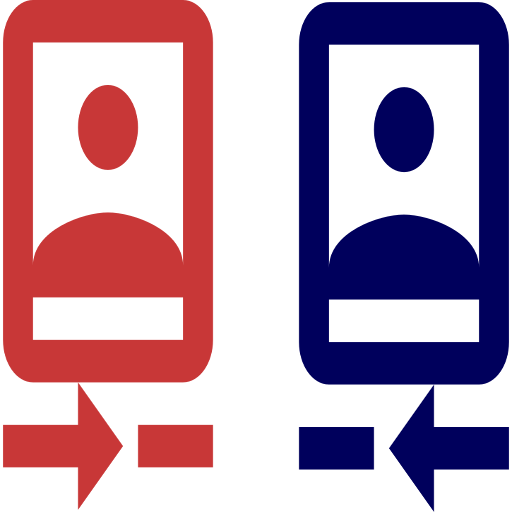
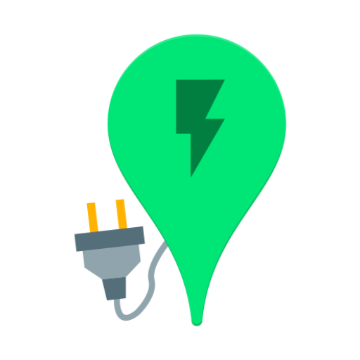

_🇪🇸 Para español, ver [README-es.md](README-es.md)_

_🇳🇱 Voor Nederlands, zie [README-nl.md](README-nl.md)_

# F-Droid

**Selection of FOSS Android apps on F-Droid**

> <em>Those who would give up essential liberty to purchase a little temporary safety, deserve neither liberty nor safety.</em> — Benjamin Franklin (1706 – 1790) American inventor, journalist, printer, diplomat and statesman, Historical Review of Pennsylvania, 1759

Safe mobile apps that respect your privacy and keep unwanted advertisements and trackers at bay, deserve extra attention. Hence, the use of <a target="_blank" href="https://en.wikipedia.org/wiki/Free_and_open-source_software">free and open source software</a> (FOSS) is advised, also for mobile devices such ass smartphones and tablets.

Below is an overview of free Android apps which can be installed from [F-Droid](https://f-droid.org/). This is a safe app store that respects your privacy. Many app can also be installed from Google Play, but the versions on F-Droid have tracking software removed. This minimizes the digital trail your online activity leaves behind.

Some of the apps listed here cost money in Google Play but are gratis on F-Droid. Good to know is that many of these apps sometimes surpass their commercial counterparts, can offer practical widgets and notification also land on connected WearOS devices.

<table>
<tr><th colspan="2"> Basic</th></tr>
<tr><td></td>
<td valign="top"><a target="_blank" href="https://f-droid.org/en/packages/org.fdroid.fdroid"><strong>F-Droid</strong></a> 
install apps from the F-Droid app store</td></tr>
<tr><td></td>
<td valign="top"><a target="_blank" href="https://f-droid.org/en/packages/com.simplemobiletools.dialer"><strong>Simple Dialer</strong></a> 
manage phone calls</td></tr>
<tr><td></td>
<td valign="top"><a target="_blank" href="https://f-droid.org/en/packages/com.simplemobiletools.contacts.pro"><strong>Simple Contacts Pro</strong></a> 
manage contacts in CardDAV</td></tr>
<tr><td></td>
<td valign="top"><a target="_blank" href="https://f-droid.org/en/packages/com.simplemobiletools.calculator"><strong>Simple Calculator</strong></a> 
make calculations</td></tr>
<tr><td></td>
<td valign="top"><a target="_blank" href="https://f-droid.org/en/packages/eu.darken.capod"><strong>CAPod</strong></a> 
use in-ear devices such as AirPods and Beats</td></tr>
<tr><td></td>
<td valign="top"><a target="_blank" href="https://f-droid.org/en/packages/com.simplemobiletools.keyboard"><strong>Simple Keyboard</strong></a> 
type with autocompletion keyboard</td></tr>
<tr><td></td>
<td valign="top"><a target="_blank" href="https://f-droid.org/en/packages/com.menny.android.anysoftkeyboard"><strong>AnySoftKeyboard</strong></a> 
type with autocompletion keyboard</td></tr>
<tr><td></td>
<td valign="top"><a target="_blank" href="https://f-droid.org/en/packages/nodomain.freeyourgadget.gadgetbridge"><strong>Gadgetbridge</strong></a> 
connect with heart rate monitors, ear buds and more</td></tr>
<tr><td></td>
<td valign="top"><a target="_blank" href="https://f-droid.org/en/packages/de.nulide.findmydevice"><strong>FindMyDevice</strong></a> 
find your mistplaced, lost or stolen device</td></tr>
<tr><td></td>
<td valign="top"><a target="_blank" href="https://f-droid.org/en/packages/ru.seva.finder"><strong>Finder</strong></a> 
find your mistplaced, lost or stolen device</td></tr>
<tr><th colspan="2"> Web browsers</th></tr>
<tr><td></td>
<td valign="top"><a target="_blank" href="https://f-droid.org/en/packages/org.mozilla.fennec_fdroid"><strong>Fennec</strong></a> 
browse with Firefox Mobile including QR scanner and Firefox Sync for password management</td></tr>
<tr><td></td>
<td valign="top"><a target="_blank" href="https://f-droid.org/en/packages/org.liberty.android.freeotpplus"><strong>FreeOTP+</strong></a> 
use two-factor authentication (2FA) with import and export</td></tr>
<tr><td></td>
<td valign="top"><a target="_blank" href="https://f-droid.org/en/packages/com.kunzisoft.keepass.libre"><strong>KeePassDX</strong></a> 
manage passwords</td></tr>
<tr><td></td>
<td valign="top"><a target="_blank" href="https://f-droid.org/en/packages/com.nextcloudpasswords"><strong>NextcloudPasswords</strong></a> 
manage and synchronize passwords with Nextcloud</td></tr>
<tr><td></td>
<td valign="top"><a target="_blank" href="https://f-droid.org/en/packages/org.schabi.nxbookmarks"><strong>Nextcloud Bookmarks</strong></a> 
manage and synchronize bookmarks with Nextcloud</td></tr>
<tr><th colspan="2"> Messaging and Communication</th></tr>
<tr><td></td>
<td valign="top"><a target="_blank" href="https://f-droid.org/en/packages/com.simplemobiletools.smsmessenger"><strong>Simple SMS Messenger</strong></a> 
manage SMS messages</td></tr>
<tr><td></td>
<td valign="top"><a target="_blank" href="https://f-droid.org/en/packages/com.nextcloud.talk2"><strong>Nextcloud Talk</strong></a> 
video conference with Nextcloud</td></tr>
<tr><td></td>
<td valign="top"><a target="_blank" href="https://f-droid.org/en/packages/org.telegram.messenger"><strong>Telegram</strong></a> 
instant messaging, voice and video calling</td></tr>
<tr><td></td>
<td valign="top"><a target="_blank" href="https://f-droid.org/en/packages/io.kuenzler.whatsappwebtogo"><strong>WhatsApp Web To Go</strong></a> 
web Whatsapp</td></tr>
<tr><td></td>
<td valign="top"><a target="_blank" href="https://f-droid.org/en/packages/im.vector.app"><strong>Element</strong></a> 
instant messaging with Matrix</td></tr>
<tr><td></td>
<td valign="top"><a target="_blank" href="https://f-droid.org/en/packages/eu.siacs.conversations"><strong>Conversations</strong></a> 
instant messaging with XMPP</td></tr>
<tr><td></td>
<td valign="top"><a target="_blank" href="https://f-droid.org/en/packages/io.heckel.ntfy"><strong>nfty</strong></a> 
receive push notifications</td></tr>
<tr><td></td>
<td valign="top"><a target="_blank" href="https://f-droid.org/en/packages/com.github.gotify"><strong>Gotify</strong></a> 
receive push notifications</td></tr>
<tr><td></td>
<td valign="top"><a target="_blank" href="https://f-droid.org/en/packages/org.linphone"><strong>Linphone</strong></a> 
calling with VOIP</td></tr>
<tr><td></td>
<td valign="top"><a target="_blank" href="https://f-droid.org/en/packages/org.avmedia.remotevideocam"><strong>Remote Video Camera</strong></a> 
stream audio and/or video between two devices</td></tr>
<tr><td></td>
<td valign="top"><a target="_blank" href="https://f-droid.org/en/packages/org.jitsi.meet"><strong>Jitsi Meet</strong></a> 
video conference</td></tr>
<tr><th colspan="2"> Files</th></tr>
<tr><td></td>
<td valign="top"><a target="_blank" href="https://f-droid.org/en/packages/com.simplemobiletools.filemanager.pro"><strong>Simple File Manager Pro</strong></a> 
manage files</td></tr>
<tr><td></td>
<td valign="top"><a target="_blank" href="https://f-droid.org/en/packages/com.nextcloud.client"><strong>Nextcloud</strong></a> 
synchronize files with Nextcloud</td></tr>
<tr><td></td>
<td valign="top"><a target="_blank" href="https://f-droid.org/en/packages/com.github.vauvenal5.yaga"><strong>Yaga</strong></a> 
manage and synchronize picture albums with Nextcloud</td></tr>
<tr><td></td>
<td valign="top"><a target="_blank" href="https://f-droid.org/en/packages/com.nutomic.syncthingandroid"><strong>Syncthing</strong></a> 
synchronize and backup files</td></tr>
<tr><td></td>
<td valign="top"><a target="_blank" href="https://f-droid.org/en/packages/com.github.catfriend1.syncthingandroid"><strong>Syncthing-Fork</strong></a> 
synchronize and backup files with extra features</td></tr>
<tr><td></td>
<td valign="top"><a target="_blank" href="https://f-droid.org/en/packages/com.google.android.diskusage"><strong>DiskUsage</strong></a> 
manage disk usage</td></tr>
<tr><td></td>
<td valign="top"><a target="_blank" href="https://f-droid.org/en/packages/at.tomtasche.reader"><strong>LibreOffice document reader</strong></a> 
view LibreOffice files</td></tr>
<tr><td></td>
<td valign="top"><a target="_blank" href="https://f-droid.org/en/packages/com.gsnathan.pdfviewer"><strong>Pdf Viewer Plus</strong></a> 
view PDF files (not needed when Simple File Manager Pro is installed)</td></tr>
<tr><th colspan="2"> Video and Images</th></tr>
<tr><td></td>
<td valign="top"><a target="_blank" href="https://f-droid.org/en/packages/com.simplemobiletools.camera"><strong>Simple Camera</strong></a> 
make photographs and videos</td></tr>
<tr><td></td>
<td valign="top"><a target="_blank" href="https://f-droid.org/en/packages/com.simplemobiletools.gallery.pro"><strong>Simple Gallery Pro</strong></a> 
manage images and videos</td></tr>
<tr><td></td>
<td valign="top"><a target="_blank" href="https://f-droid.org/en/packages/org.schabi.newpipe"><strong>NewPipe</strong></a> 
play YouTube, SoundCloud, Bandcamp, etc. content as video or audio, also in the background</td></tr>
<tr><td></td>
<td valign="top"><a target="_blank" href="https://f-droid.org/en/packages/cz.martykan.webtube"><strong>WebTube</strong></a> 
play YouTube content as video or audio, also in the background and login is possible</td></tr>
<tr><td></td>
<td valign="top"><a target="_blank" href="https://f-droid.org/en/packages/com.github.niqdev.ipcam"><strong>IPCam Demo</strong></a> 
view IP camera streamss</td></tr>
<tr><td></td>
<td valign="top"><a target="_blank" href="https://f-droid.org/en/packages/org.videolan.vlc"><strong>VLC</strong></a> 
play video or audio from files or streams</td></tr>
<tr><td></td>
<td valign="top"><a target="_blank" href="https://f-droid.org/en/packages/org.xbmc.kodi"><strong>Kodi</strong></a> 
play video or audio from files or streams</td></tr>
<tr><td></td>
<td valign="top"><a target="_blank" href="https://f-droid.org/en/packages/org.xbmc.kore"><strong>Kore</strong></a> 
remote control for Kodi</td></tr>
<tr><th colspan="2"> Email</th></tr>
<tr><td></td>
<td valign="top"><a target="_blank" href="https://f-droid.org/en/packages/com.fsck.k9"><strong>K-9 Mail</strong></a> 
send and receive emails</td></tr>
<tr><td></td>
<td valign="top"><a target="_blank" href="https://f-droid.org/en/packages/org.sufficientlysecure.keychain"><strong>OpenKeychain</strong></a> 
encrypt and decrypt texts and files for K-9 Mail, etc.</td></tr>
<tr><th colspan="2"> Calendars and Tasks</th></tr>
<tr><td></td>
<td valign="top"><a target="_blank" href="https://f-droid.org/en/packages/com.simplemobiletools.calendar.pro"><strong>Simple Calendar Pro</strong></a> 
manage calendars in CalDAV</td></tr>
<tr><td></td>
<td valign="top"><a target="_blank" href="https://f-droid.org/en/packages/ws.xsoh.etar"><strong>Etar</strong></a> 
manage calendars in CalDAV</td></tr>
<tr><td></td>
<td valign="top"><a target="_blank" href="https://f-droid.org/en/packages/at.bitfire.icsdroid"><strong>ICSx⁵</strong></a> 
add network calendars in ICS format to Simple Calendar Pro and Etar (see also the <a target="_blank" href="https://www.thunderbird.net/en-US/calendar/holidays/">Thunderbird Holiday Calendars</a>)</td></tr>
<tr><td></td>
<td valign="top"><a target="_blank" href="https://f-droid.org/en/packages/saschpe.contactevents"><strong>Birthday Adapter</strong></a> 
add birthdays from address book to Simple Calendar Pro and Etar (see also for <a target="_blank" href="https://addons.thunderbird.net/en-US/thunderbird/addon/thunderbirthday/">Thunderbird</a>)</td></tr>
<tr><td></td>
<td valign="top"><a target="_blank" href="https://f-droid.org/en/packages/at.bitfire.davdroid"><strong>DAVx⁵</strong></a> 
synchronize calendars, tasks and contacts in CalDAV and CardDav (see also for <a target="_blank" href="https://addons.thunderbird.net/en-US/thunderbird/addon/dav-4-tbsync/">Thunderbird</a>)</td></tr>
<tr><td></td>
<td valign="top"><a target="_blank" href="https://f-droid.org/en/packages/com.woefe.shoppinglist"><strong>Shopping List</strong></a> 
manage tasks in files</td></tr>
<tr><td></td>
<td valign="top"><a target="_blank" href="https://f-droid.org/en/packages/com.simplemobiletools.notes.pro"><strong>Simple Notes Pro</strong></a> 
manage tasks in CalDAV</td></tr>
<tr><td></td>
<td valign="top"><a target="_blank" href="https://f-droid.org/en/packages/org.tasks"><strong>Tasks.org</strong></a> 
manage tasks in CalDAV</td></tr>
<tr><td></td>
<td valign="top"><a target="_blank" href="https://f-droid.org/en/packages/it.niedermann.owncloud.notes"><strong>Notes</strong></a> 
manage and synchronize notes with Nextcloud</td></tr>
<tr><td></td>
<td valign="top"><a target="_blank" href="https://f-droid.org/en/packages/it.niedermann.nextcloud.deck"><strong>Nextcloud Deck</strong></a> 
manage and synchronize kanban cards with Nextcloud</td></tr>
<tr><th colspan="2"> Audio</th></tr>
<tr><td></td>
<td valign="top"><a target="_blank" href="https://f-droid.org/en/packages/com.simplemobiletools.voicerecorder"><strong>Simple Voice Recorder</strong></a> 
make audio recordings</td></tr>
<tr><td></td>
<td valign="top"><a target="_blank" href="https://f-droid.org/en/packages/com.simplemobiletools.musicplayer"><strong>Simple Music Player</strong></a> 
play music files</td></tr>
<tr><td></td>
<td valign="top"><a target="_blank" href="https://f-droid.org/en/packages/ch.blinkenlights.android.vanilla"><strong>Vanilla Music</strong></a> 
play music files</td></tr>
<tr><td></td>
<td valign="top"><a target="_blank" href="https://f-droid.org/en/packages/org.y20k.transistor"><strong>Transistor</strong></a> 
play audio streams</td></tr>
<tr><td></td>
<td valign="top"><a target="_blank" href="https://f-droid.org/en/packages/org.musicpd"><strong>MPD</strong></a> 
remote control for MPD</td></tr>
<tr><td></td>
<td valign="top"><a target="_blank" href="https://f-droid.org/en/packages/org.gateshipone.malp"><strong>M.A.L.P.</strong></a> 
remote control for MPD</td></tr>
<tr><td></td>
<td valign="top"><a target="_blank" href="https://f-droid.org/en/packages/de.danoeh.antennapod"><strong>AntennaPod</strong></a> 
podcasts</td></tr>
<tr><td></td>
<td valign="top"><a target="_blank" href="https://f-droid.org/en/packages/org.y20k.escapepod"><strong>Escapepod</strong></a> 
podcasts</td></tr>
<tr><td></td>
<td valign="top"><a target="_blank" href="https://f-droid.org/en/packages/com.shabinder.spotiflyer"><strong>SpotiFlyer</strong></a> 
download from e.g. Spotify, SoundCloud, YouTube</td></tr>
<tr><th colspan="2"> Route Planning, Navigation and Travel</th></tr>
<tr><td></td>
<td valign="top"><a target="_blank" href="https://f-droid.org/en/packages/net.eneiluj.nextcloud.phonetrack"><strong>PhoneTrack</strong></a> 
log and synchronisize geolocations in Nextcloud</td></tr>
<tr><td></td>
<td valign="top"><a target="_blank" href="https://f-droid.org/en/packages/app.organicmaps"><strong>Organic Maps</strong></a> 
plan routes and navigate with OpenStreetMap for walking, cycling and driving, online and offline</td></tr>
<tr><td></td>
<td valign="top"><a target="_blank" href="https://f-droid.org/en/packages/net.osmand.plus"><strong>OsmAnd</strong></a> 
plan routes and navigate with OpenStreetMap for walking, cycling, driving and sailing, online and offline</td></tr>
<tr><td></td>
<td valign="top"><a target="_blank" href="https://f-droid.org/en/packages/de.grobox.liberario"><strong>Transportr</strong></a> 
plan public transport with NS, 9292, etc.</td></tr>
<tr><td></td>
<td valign="top"><a target="_blank" href="https://f-droid.org/en/packages/de.westnordost.streetcomplete"><strong>StreetComplete</strong></a> 
extend OpenStreetMap in an easy way</td></tr>
<tr><td></td>
<td valign="top"><a target="_blank" href="https://f-droid.org/en/packages/net.vonforst.evmap"><strong>EVMap</strong></a> 
find electric vehicle chargers on OpenStreetMap</td></tr>
<tr><td></td>
<td valign="top"><a target="_blank" href="https://f-droid.org/en/packages/com.google.android.stardroid"><strong>Sky Map</strong></a> 
explore stars, planets en meer in the sky</td></tr>
<tr><td></td>
<td valign="top"><a target="_blank" href="https://f-droid.org/en/packages/net.gitsaibot.af"><strong>AF Weather Widget</strong></a> 
view weather graphs in widgets</td></tr>
<tr><td></td>
<td valign="top"><a target="_blank" href="https://f-droid.org/en/packages/org.ligi.passandroid"><strong>PassAndroid</strong></a> 
view Passbook files for events and travel tickets</td></tr>
<tr><th colspan="2"> Social Media</th></tr>
<tr><td></td>
<td valign="top"><a target="_blank" href="https://f-droid.org/en/packages/com.keylesspalace.tusky"><strong>Tusky</strong></a> 
Mastodon</td></tr>
<tr><td></td>
<td valign="top"><a target="_blank" href="https://f-droid.org/en/packages/com.twidere.twiderex"><strong>Twidere X</strong></a> 
Mastodon, etc.</td></tr>
<tr><td></td>
<td valign="top"><a target="_blank" href="https://f-droid.org/en/packages/com.pitchedapps.frost"><strong>Frost for Facebook</strong></a> 
Facebook</td></tr>
<tr><td></td>
<td valign="top"><a target="_blank" href="https://f-droid.org/en/packages/it.rignanese.leo.slimfacebook"><strong>SlimSocial for Facebook</strong></a> 
Facebook</td></tr>
<tr><th colspan="2"> Financial</th></tr>
<tr><td></td>
<td valign="top"><a target="_blank" href="https://f-droid.org/en/packages/org.btcmap"><strong>BTC Map</strong></a> 
find where to spend bitcoins</td></tr>
<tr><td></td>
<td valign="top"><a target="_blank" href="https://f-droid.org/en/packages/eu.uwot.fabio.altcoinprices"><strong>Altcoin Prices</strong></a> 
prices and portfolio cryptocurrencies</td></tr>
<tr><td></td>
<td valign="top"><a target="_blank" href="https://f-droid.org/en/packages/de.cloneapps.crypto_prices"><strong>Crypto Prices</strong></a> 
prices and portfolio cryptocurrencies</td></tr>
<tr><td></td>
<td valign="top"><a target="_blank" href="https://f-droid.org/en/packages/hashengineering.darkcoin.wallet"><strong>Dash Wallet</strong></a> 
wallet cryptocurrency Dash</td></tr>
<tr><td></td>
<td valign="top"><a target="_blank" href="https://f-droid.org/en/packages/org.dash.electrum.electrum_dash"><strong>Dash Electrum</strong></a> 
wallet cryptocurrency Dash</td></tr>
<tr><td></td>
<td valign="top"><a target="_blank" href="https://f-droid.org/en/packages/org.walleth"><strong>WallETH</strong></a> 
wallet cryptocurrency Ethereum</td></tr>
<tr><th colspan="2"> Network</th></tr>
<tr><td></td>
<td valign="top"><a target="_blank" href="https://f-droid.org/en/packages/ch.protonvpn.android"><strong>ProtonVPN</strong></a> 
use free VPN</td></tr>
<tr><td></td>
<td valign="top"><a target="_blank" href="https://f-droid.org/en/packages/org.calyxinstitute.vpn"><strong>Calyx VPN</strong></a> 
use free VPN without manual settings</td></tr>
<tr><td></td>
<td valign="top"><a target="_blank" href="https://f-droid.org/en/packages/com.aaronjwood.portauthority"><strong>Port Authority</strong></a> 
scan LAN and ports</td></tr>
<tr><td></td>
<td valign="top"><a target="_blank" href="https://f-droid.org/en/packages/com.vrem.wifianalyzer"><strong>WiFiAnalyzer</strong></a> 
optimize wifi networks</td></tr>
<tr><td></td>
<td valign="top"><a target="_blank" href="https://f-droid.org/en/packages/org.connectbot"><strong>ConnectBot</strong></a> 
SSH and Telnet</td></tr>
<tr><td></td>
<td valign="top"><a target="_blank" href="https://f-droid.org/en/packages/de.eidottermihi.raspicheck"><strong>Raspi Check</strong></a> 
manage Raspberry Pis</td></tr>
<tr><td></td>
<td valign="top"><a target="_blank" href="https://f-droid.org/en/packages/org.openhab.habdroid"><strong>openHAB</strong></a> 
remote control home automation</td></tr>
<tr><td></td>
<td valign="top"><a target="_blank" href="https://f-droid.org/en/packages/io.homeassistant.companion.android.minimal"><strong>Home Assistant</strong></a> 
remote control home automation</td></tr>
<tr><td></td>
<td valign="top"><a target="_blank" href="https://f-droid.org/en/packages/com.manimarank.websitemonitor"><strong>Website Monitor</strong></a> 
monitor if websites are online</td></tr>
<tr><th colspan="2"> Health</th></tr>
<tr><td></td>
<td valign="top"><a target="_blank" href="https://f-droid.org/en/packages/com.health.openscale"><strong>openScale</strong></a> 
track weight and body metrics</td></tr>
<tr><td></td>
<td valign="top"><a target="_blank" href="https://f-droid.org/en/packages/org.runnerup.free"><strong>RunnerUp</strong></a> 
track sport activities</td></tr>
<tr><td></td>
<td valign="top"><a target="_blank" href="https://f-droid.org/en/packages/com.jithware.brethap"><strong>Brethap</strong></a> 
control your breathing during meditation</td></tr>
<tr><td></td>
<td valign="top"><a target="_blank" href="https://f-droid.org/en/packages/de.arnowelzel.android.periodical"><strong>Periodical</strong></a> 
track days of fertility with Knaus-Ogino method</td></tr>
<tr><td></td>
<td valign="top"><a target="_blank" href="https://f-droid.org/en/packages/flunzmas.seasoncalendar"><strong>Seasonal Foods Calendar</strong></a> 
find regional seasonal foods from nearby produce</td></tr>
<tr><th colspan="2"> Netherlands</th></tr>
<tr><td></td>
<td valign="top"><a target="_blank" href="https://f-droid.org/en/packages/com.anysoftkeyboard.languagepack.dutch_oss"><strong>AnySoftKeyboard Dutch</strong></a> 
Dutch support for AnySoftKeyboard</td></tr>
<tr><td></td>
<td valign="top"><a target="_blank" href="https://f-droid.org/en/packages/foss.cnugteren.nlweer"><strong>NLWeer</strong></a> 
Dutch weather and precipitation from KNMI and Buienrader</td></tr>
</table>

If you want to go one step further, please consider installing [LineageOS](https://en.wikipedia.org/wiki/LineageOS) on your device. This is Android without preinstalled apps from Google, without preinstalled apps from the manufacturor of your device and without preinstalled apps from your provider. By also installing Open GApps pico, you have the possibility to install apps from Google Play, but only the one you choose, such as Signal Private Messenger.

See also:
- [Selection of FOSS for Windows, macOS and Linux](https://github.com/PanderMusubi/foss/blob/main/README.md)
- [PRISM Break](https://prism-break.org/en/)
- [Droid-Break](https://droid-break.info/)

This overview was started in 2013 by [Hellebaard](http://hellebaard.nl) and predates those of PRISM Break and Droid-Break.

